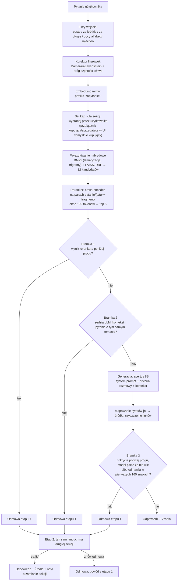

# Chatbot RAG: odpowiedzi wyłącznie z bazy dokumentów

[](https://github.com/OskarOG1/Chatbot-RAG/actions/workflows/ci.yml)

Chatbot, który odpowiada na pytania **tylko na podstawie dostarczonych artykułów**, nigdy z ogólnej wiedzy modelu. Każda odpowiedź ma odnośniki do źródeł. Gdy odpowiedzi nie ma w bazie, system odmawia zamiast zmyślać.

**Demo: [ogflow.pl](https://ogflow.pl)**

Baza testowa: 667 artykułów Allegro Pomoc, dwie sekcje (kupujący, sprzedający) w dwóch językach. Projekt edukacyjny, niezwiązany z Allegro.

> Pełny zapis pracy, czyli każda decyzja z pomiarem i każda hipoteza odrzucona liczbami, jest w osobnym pliku: **[DECYZJE.md](DECYZJE.md)**. Ten README opisuje sam system.

---

## W skrócie

| Co mierzone | Wynik |
|---|---|
| Baza wiedzy | 667 artykułów, 3551 fragmentów: PL 353 art./2109 frag., EN 314 art./1442 frag. |
| Trafność wyszukiwania, top 5 | kupujący PL **0.840** · sprzedaż PL **1.000** · kupujący EN **0.800** · sprzedaż EN **0.947** |
| Fałszywe odmowy na bramce pokrycia | PL 0/29 · EN 1/50 |
| Pytania nie na temat złapane | PL 29/29 · EN 29/29 |
| Testy jednostkowe | **305/305** zielonych, CI na każdym pushu i PR |
| Model odpowiadający | apertus 8B, PL i EN (identyfikator ustawia `MODEL` w `.env`) |

**Znane ograniczenie.** Trafność kupujący EN (0.800) zostaje około 12 punktów procentowych pod sufitem 0.920, bo artykuły o koncie, logowaniu i RODO nakładają się między sekcją kupujących i sprzedających. Jawny przełącznik strony w interfejsie zamyka tę lukę dla użytkownika, który wie, po której jest stronie.

---

## Jak to działa



**Trzy niezależne bramki odmowy.** Przed wyszukiwaniem odpadają pytania puste, za krótkie, za długie i próby manipulacji promptem. Przed generacją: jeśli żaden fragment nie pasuje wystarczająco, model w ogóle nie jest wołany, a pytania graniczne ocenia osobne, tanie wywołanie modelu. Po generacji sprawdzane jest, ile ważnych słów odpowiedzi faktycznie występuje w źródłach.

**Sędzia pracuje równolegle z generacją.** Pierwsze 40 tokenów czeka w buforze na jego werdykt, więc bramka nie kosztuje czasu do pierwszego tokenu. Gdy bramka po generacji odrzuci odpowiedź, która już poszła do przeglądarki, klient dostaje zdarzenie `reset` i czyści to, co pokazał.

**Dane mogą nie opuszczać serwera.** Wyszukiwanie, embeddingi i reranking działają lokalnie. Model generujący też może być lokalny, u mnie nie jest, ze względu na sprzęt.

---

## Szybki start

Potrzebny Docker i endpoint modelu zgodny z API OpenAI (lokalna Ollama albo dostawca w chmurze).

```bash
cp docker/.env.example docker/.env
```

Uzupełnij w `docker/.env` co najmniej `LLM_BASE_URL`, `LLM_API_KEY`, `MODEL` i `DOMAIN`, potem:

```bash
docker compose -f docker/docker-compose.yml up -d --build
```

Frontend stanie na porcie 80 i 443 przez Caddy, API tylko w sieci wewnętrznej. Pierwszy start trwa dłużej, bo kontener rozgrzewa reranker, dwa embeddery i indeksy.

**Repozytorium nie zawiera korpusu.** Katalogi `RAG/docs*` i zbudowane indeksy są poza gitem. Żeby zbudować bazę od zera, z katalogu `src/`:

```bash
python links_scraping.py && python links_scraping_sprzedaz.py --lang pl
```

```bash
python chunking.py --lang pl --docs-dir ../RAG/docs --out ../RAG/chunks_kupujacy.json
```

```bash
python chunking.py --lang pl --docs-dir ../RAG/docs_sprzedaz --out ../RAG/chunks_sprzedaz.json
```

```bash
python scal_korpus.py --lang pl && python embedder.py --lang pl && python vector.py --lang pl
```

Podmiana korpusu na działającej instancji wymaga `docker compose restart api`: indeksy BM25 i FAISS wczytują się raz do pamięci procesu i nie mają inwalidacji, mimo że cache odpowiedzi odświeża się sam po zmianie plików.

Testy:

```bash
pytest tests -q
```

---

## Dobór technologii

| Element | Wybór | Dlaczego |
|---|---|---|
| Embeddingi | mmlw | Trenowany pod polski, łapie znaczenie lepiej niż model wielojęzyczny |
| Baza wektorowa | FAISS | Lokalna, szybka, wystarcza na tej skali |
| Wyszukiwanie po słowach | BM25 + lematyzacja + trigramy | Sam embedding gubił pytania zbudowane wokół konkretnych słów |
| Reranker | mmarco-mMiniLMv2 (118M) | 26x szybszy od bge-v2-m3 przy stracie jednego trafienia, po zmianie okna na 192 i doklejeniu tytułu jeszcze 3,81x szybszy i trafniejszy |
| Model odpowiadający | apertus 8B | Na pomiarze 25 pytań PL i 25 EN dorównuje lub przewyższa Bielika-11B jakością, bez błędów API, około 3x szybszy |
| Sędzia kontekstu | Bielik-11B (PL), Olmo-3-7B (EN) | Odpięty od modelu odpowiadającego, decyzja TAK/NIE jest lżejsza niż generacja |

Uzasadnienia z liczbami, razem z wariantami odrzuconymi, są w [DECYZJE.md](DECYZJE.md).

---

## Bezpieczeństwo i odporność

**Manipulacja promptem.** Filtry wejścia odrzucają znane wzorce, także po odwróceniu leetspeaku, ale realną obroną jest oparcie odpowiedzi na kontekście i bramka pokrycia. Filtr wzorców to jedna warstwa, nie całość.

**Logi bez danych osobowych.** `trudne.jsonl` dostaje wyłącznie nierozpoznane pojedyncze słowa, nigdy całe pytanie. Log analityczny zapisuje treść pytania dopiero po redakcji: maile, telefony, numery zamówień i adresy URL idą do `[ukryte]`.

**Limity.** Globalny (domyślnie 15/min, 200/dzień) chroni budżet API, per IP (10/min, 40/dzień) chroni przed pojedynczym nadużywającym klientem. Osobne, luźniejsze progi mają oceny i panel. Wysyłka maila ma własny, najostrzejszy limit, bo to jedyne prawdziwe wywołanie zewnętrzne.

**Awarie nie blokują odpowiedzi, ale zostawiają ślad.** Gdy sędzia albo dane IDF są niedostępne, bramka jest pomijana, a zapytanie odnotowane w logu jako `bramki_pominiete`. Gdy w oknie 50 zapytań ponad 20 procent ma pominiętą bramkę, serwer krzyczy na stderr. Model główny ma automatyczny fallback na zapasowy.

---

## API i frontend

Backend: **FastAPI**. `POST /chat` zwraca JSON (odpowiedź, źródła, cytaty), `POST /chat/stream` ten sam proces przez SSE. Poza tym `POST /send-email`, `POST /ocena` oraz `GET /admin/statystyki`, `/admin/oceny`, `/admin/eksport` i `POST /admin/resetuj-statystyki` pod panel analityczny. Reset jest jedyną operacją nieodwracalną, wymaga nagłówka `x-admin-token` i archiwizuje log zamiast go kasować.

Strumień SSE ma pięć typów zdarzeń: `krok` (co system właśnie robi), `token` (fragment odpowiedzi), `reset` (bramka odrzuciła to, co już poszło do przeglądarki), `wynik` (koniec tury z cytatami) i `blad`. Obsługa `reset` jest w kliencie obowiązkowa.

Frontend: **Next.js** (`frontend-next/`). Czat ze streamingiem, klikalne cytaty, panel edycji maila z porzuceniem szkicu, 15-sekundowym oknem na cofnięcie wysyłki i korektą po wysłaniu, oraz panel analityczny pod `/admin`. Przeglądarka nie rozmawia z FastAPI bezpośrednio, wszystko idzie przez Route Handlery, więc jeden origin i zero CORS.

**Cytaty.** Prompt każe wstawiać odnośniki `[n]` i zabrania gołych adresów URL. Kod wycina linki z tekstu i mapuje `[n]` na źródło. Cytaty służą wyłącznie do wyświetlania, do odmowy używane jest pokrycie, nie obecność `[n]`.

**Pamięć rozmowy.** Okno 3 tur. Dopytania wykryte tanim detektorem są przepisywane przez model na samodzielne pytanie przed wyszukiwaniem, więc „a co jeśli sprzedawca nie odpowiada?" po pytaniu o reklamację trafia poprawnie.

---

## Wersja dwujęzyczna i wysyłka maila

Druga, równoległa ścieżka dla klienta anglojęzycznego: własny embedder (`multilingual-e5-base`), własny indeks, własny sędzia i własne progi odmowy (`prog_rerank` −3.6, `prog_pokrycia` 0.35 wobec −5.7 i 0.20 dla polskiego). Językiem steruje detekcja po częstości słów, nie przełącznik, więc pytanie po polsku zawsze dostaje odpowiedź po polsku.

Panel edycji maila ma prawdziwy przycisk wysyłki. Treść idzie do stałej demo-skrzynki sprzedawcy, a potwierdzenie z numerem zgłoszenia na adres klienta, przez REST Resend, bez SMTP. Bez skonfigurowanego `RESEND_API_KEY` wysyłka zwraca czytelny błąd konfiguracji, nigdy fałszywy sukces. Log serwera zapisuje tylko numer zgłoszenia, kategorię i wynik, nigdy adresu ani treści.

---

## Struktura repozytorium

```
src/            backend: pipeline, bramki, retrieval, agenci, API
frontend-next/  frontend Next.js, czat i panel analityczny
tests/          305 testów jednostkowych, bez wywołań modelu
docker/         compose, Dockerfile API, Caddy, skrypty kopii zapasowych
RAG/            korpus, indeksy i logi (poza gitem)
```

Szczegóły: [DECYZJE.md](DECYZJE.md).
