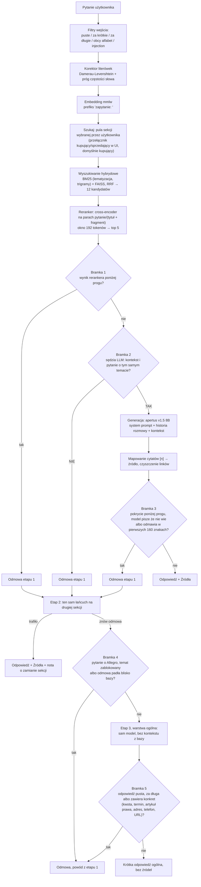

# Chatbot RAG: odpowiedzi wyłącznie z bazy dokumentów

[](https://github.com/OskarOG1/Chatbot-RAG/actions/workflows/ci.yml)

Chatbot, który na pytania o Allegro odpowiada **tylko na podstawie dostarczonych artykułów**, nigdy z ogólnej wiedzy modelu. Każda taka odpowiedź ma odnośniki do źródeł. Gdy odpowiedzi nie ma w bazie, system odmawia zamiast zmyślać. Pytanie spoza domeny Allegro może dostać krótką odpowiedź ogólną bez źródeł, obwarowaną własnym zestawem bramek (trzeci szczebel na diagramie niżej).

**Demo: [ogflow.pl](https://ogflow.pl)**

Baza testowa: 667 artykułów Allegro Pomoc, dwie sekcje (kupujący, sprzedający) w dwóch językach. Projekt edukacyjny, niezwiązany z Allegro.

> Pełny zapis pracy, czyli każda decyzja z pomiarem i każda hipoteza odrzucona liczbami, jest w osobnym pliku: **[DECYZJE.md](DECYZJE.md)**. Ten README opisuje sam system.

---

## W skrócie

| Co mierzone | Wynik |
|---|---|
| Baza wiedzy | 667 artykułów, 3551 fragmentów: PL 353 art./2109 frag., EN 314 art./1442 frag. |
| Trafność wyszukiwania, top 5 | kupujący PL **0.700** · sprzedaż PL **0.950** · kupujący EN **0.760** · sprzedaż EN **1.000** |
| Odpowiedź bez odmowy, pełny pipeline (GOLDEN, kupujący PL, 50 pytań) | **49/50** |
| Oczekiwane źródło w odpowiedzi, pełny pipeline (GOLDEN, kupujący PL, 50 pytań) | **40/50** |
| Odpowiedź bez odmowy, pełny pipeline (50 realnych pytań z forum Allegro, bez znanego źródła) | **40/50** |
| Fałszywe odmowy na bramce pokrycia | PL 0/29 · EN 1/50 |
| Pytania nie na temat złapane, pełny łańcuch | PL **25/26** (próg rerankera 17, sędzia 8) |
| Testy jednostkowe | **351/351** zielonych, CI na każdym pushu i PR |
| Model odpowiadający | apertus v1.5 8B, PL · apertus 8B instruct, EN (`MODEL` i `MODEL_EN` w `.env`) |

**Skąd te liczby.** Pomiar z 2026-08-26 na ścieżce, która faktycznie obsługuje ruch: korekta literówek, embedding, BM25 i FAISS z RRF po obu sekcjach naraz, reranker, rozstrzygnięcie strony przez `strony.rozstrzygnij`. Zestawy: kupujący PL i EN po 50 pytań, sprzedaż PL 20, sprzedaż EN 19, wszystkie ze znanym źródłem (`Pomiary/dane_measure.json` oraz `RAG/golden_*.json`). Wcześniejsze wartości w tym wierszu (kupujący PL 0.840) pochodziły z innej konfiguracji: jedna sekcja zamiast dwóch i `k_surowe` 20 zamiast 6, co odnotowuje docstring `Pomiary/measure.py`. Nie są więc porównywalne i nie oznaczają regresji, ale opisywały układ, którego już nie ma.

**Znane ograniczenie.** Trafność kupujący PL i EN (0.700 i 0.760) zostaje wyraźnie pod sprzedażową, bo artykuły o koncie, logowaniu i RODO nakładają się między sekcją kupujących i sprzedających. Na zestawie kupujący PL wszystkie sześć przerzutów na sekcję sprzedaży straciło oczekiwane źródło. Zablokowanie przerzutów podnosi ten wynik do 0.780, ale zabiera trafienia użytkownikowi, który stoi na drugiej zakładce, i tam spada ono do zera (`Pomiary/WYNIK_ZLA_ZAKLADKA.json`). Jawny przełącznik strony w interfejsie zamyka tę lukę dla użytkownika, który wie, po której jest stronie.

**O bramkach.** Wiersz "pytania nie na temat" mierzy cały łańcuch na 26 pytaniach spoza bazy (`OOD_SPOZA_TEMATU` 19 plus `OOD_ALLEGRO_POZA_BAZA` 7). Pozostałe 3 pytania z listy `OOD_DO_AUDYTU` pominięto celowo, bo to sensowne pytania sprzedawcy, na które baza ma odpowiedź, więc ich przepuszczenie nie jest błędem. Rozkład pracy między bramkami: próg rerankera zatrzymuje 17, sędzia kontekstu 8, przecieka 1. Fałszywe odmowy na golden: 4/50. Wcześniejsza wartość 29/29 nie jest porównywalna, bo liczyła inny zestaw i inny próg.

**Bramka odmowy stoi na sędzim.** Sam próg rerankera zatrzymuje 17 z 26 pytań spoza bazy, resztę łapie sędzia, czyli wywołanie modelu. Gdy sędzia jest niedostępny, zapytanie idzie dalej i trafia do logu jako `bramki_pominiete`, a przeciek rośnie z 1/26 do 9/26. Progiem tej luki nie da się zamknąć: pytania o Allegro, na które baza nie ma odpowiedzi, dostają od rerankera mediany wyższe niż pytania golden (+2.65 wobec +2.61), bo reranker mierzy podobieństwo tematu, nie obecność odpowiedzi.

**Trafność mierzy sam retrieval, nie odpowiedź.** Pozycje 4 i 5 nie zawierały oczekiwanego źródła ani razu na żadnym zestawie PL, czyli top 3 i top 5 dają ten sam wynik.

**Trzy wiersze niżej zmierzono na Bieliku-11B.** Wiersze o pełnym pipeline (49/50, 40/50, 40/50) pochodzą sprzed przełączenia modelu odpowiadającego na apertusa i nie zostały powtórzone. Opisują ten sam łańcuch z innym modelem generującym, więc traktuj je jako punkt odniesienia, nie jako stan bieżący.

**O trzech nowych wierszach.** To pomiar innego rodzaju niż wiersz "Trafność wyszukiwania" powyżej: nie sam retrieval, tylko cały `pipeline.run` (korektor, reranker, sędzia kontekstu, generacja Bielikiem-11B), na dwóch zestawach po 50 pytań. GOLDEN ma znane źródło, więc liczy się i odmowa, i trafienie. 50 pytań realnych to ręcznie odsiane, sensowne pytania o Allegro z `RAG/pytania_realne.jsonl` (5096 wpisów z forum), bez znanego źródła, więc liczy się tylko, czy system w ogóle odpowiedział: 8 odmów sędziego kontekstu, po jednej na bramce rerankera i na "model nie wie". Nie jest to bezpośrednie porównanie z wierszem wyżej (inny model, inna metodologia, brak rozbicia na sprzedaż/EN), patrz `Pomiary/measure.py`.

---

## Jak to działa



**Trzy niezależne bramki odmowy.** Przed wyszukiwaniem odpadają pytania puste, za krótkie, za długie i próby manipulacji promptem. Przed generacją: jeśli żaden fragment nie pasuje wystarczająco, model w ogóle nie jest wołany, a pytania graniczne ocenia osobne, tanie wywołanie modelu. Po generacji sprawdzane jest, ile ważnych słów odpowiedzi faktycznie występuje w źródłach.

**Trzeci szczebel odpowiada bez bazy, ale nigdy o Allegro.** Gdy obie sekcje odmówią, pytanie trafia do warstwy ogólnej (`src/ogolna.py`, wyłącznik `OGOLNA_ON`). Ta warstwa odrzuca wszystko, co wygląda na pytanie o Allegro, co dotyka tematu zablokowanego albo co odpadło blisko bazy, a wygenerowaną odpowiedź kasuje, jeśli pada w niej jakikolwiek konkret: kwota, termin, artykuł prawa, adres, telefon albo odnośnik. Dzięki temu obietnica z pierwszego akapitu obowiązuje bez wyjątku dla domeny Allegro.

**Sędzia pracuje równolegle z generacją.** Pierwsze 40 tokenów czeka w buforze na jego werdykt, więc bramka nie kosztuje czasu do pierwszego tokenu. Gdy bramka po generacji odrzuci odpowiedź, która już poszła do przeglądarki, klient dostaje zdarzenie `reset` i czyści to, co pokazał.

**Dane mogą nie opuszczać serwera.** Wyszukiwanie, embeddingi i reranking działają lokalnie. Model generujący też może być lokalny, u mnie nie jest, ze względu na sprzęt.

---

## Szybki start

Potrzebny Docker i endpoint modelu zgodny z API OpenAI (lokalna Ollama albo dostawca w chmurze).

```bash
cp docker/.env.example docker/.env
```

Uzupełnij w `docker/.env` co najmniej `LLM_BASE_URL`, `LLM_API_KEY`, `MODEL` i `DOMAIN`, potem:

`ADMIN_TOKEN` jest osobną sprawą: bez niego panel kolejki zgłoszeń i reset statystyk odpowiadają kodem 503, a same zgłoszenia od użytkowników zapisują się dalej. Pusty token wyłącza więc odczyt kolejki, nie jej zbieranie.

```bash
docker compose -f docker/docker-compose.yml up -d --build
```

Frontend stanie na porcie 80 i 443 przez Caddy, API tylko w sieci wewnętrznej. Pierwszy start trwa dłużej, bo kontener rozgrzewa reranker, dwa embeddery i indeksy.

**Repozytorium nie zawiera korpusu.** Katalogi `RAG/docs*` i zbudowane indeksy są poza gitem. Żeby zbudować bazę od zera, z katalogu `src/`:

```bash
python links_scraping.py && python links_scraping_sprzedaz.py --lang pl
```

```bash
python chunking.py --lang pl --docs-dir ../RAG/docs --out ../RAG/chunks_kupujacy.json
```

```bash
python chunking.py --lang pl --docs-dir ../RAG/docs_sprzedaz --out ../RAG/chunks_sprzedaz.json
```

```bash
python scal_korpus.py --lang pl && python embedder.py --lang pl && python vector.py --lang pl
```

Podmiana korpusu na działającej instancji nie wymaga restartu, pod warunkiem że odświeżysz wszystkie trzy artefakty naraz: `chunks_*.json`, `*.bm25` i `*.faiss`. Każdy z nich ma osobny cache w pamięci procesu, unieważniany po znaczniku czasu własnego pliku. Podmiana samych chunków bez przebudowy indeksu nie wywoła błędu, tylko cicho rozjedzie numerację: FAISS zwróci pozycje ze starego indeksu, a odczytane zostaną nowe fragmenty.

Testy:

```bash
pytest tests -q
```

---

## Dobór technologii

| Element | Wybór | Dlaczego |
|---|---|---|
| Embeddingi | mmlw | Trenowany pod polski, łapie znaczenie lepiej niż model wielojęzyczny |
| Baza wektorowa | FAISS | Lokalna, szybka, wystarcza na tej skali |
| Wyszukiwanie po słowach | BM25 + lematyzacja + trigramy | Sam embedding gubił pytania zbudowane wokół konkretnych słów |
| Reranker | mmarco-mMiniLMv2 (118M) | 26x szybszy od bge-v2-m3 przy stracie jednego trafienia, po zmianie okna na 192 i doklejeniu tytułu jeszcze 3,81x szybszy i trafniejszy |
| Model odpowiadający | apertus v1.5 8B | Na 11 realnych pytaniach PL szybszy od Bielika-11B w 11 parach na 11, mediana 3.45 s wobec 6.54 s, najgorszy przypadek 6.3 s wobec 22.7 s |
| Sędzia kontekstu | Bielik-11B (PL), Olmo-3-7B (EN) | Odpięty od modelu odpowiadającego, decyzja TAK/NIE jest lżejsza niż generacja |

**Sędzia i mail zostają na Bieliku.** `SEDZIA_MODEL` oraz `EMAIL_MODEL` to osobne zmienne i przełączenie `MODEL` ich nie dotyczy. Sędzia celowo, bo decyzja TAK/NIE jest innym zadaniem niż generacja i nie była mierzona na apertusie. Szkic maila (`agents_mail.py`) czyta `EMAIL_MODEL` na sztywno, więc maile dalej pisze Bielik: to nie jest decyzja poparta pomiarem, tylko stan zastany.

Uzasadnienia z liczbami, razem z wariantami odrzuconymi, są w [DECYZJE.md](DECYZJE.md).

---

## Bezpieczeństwo i odporność

**Manipulacja promptem.** Filtry wejścia odrzucają znane wzorce, także po odwróceniu leetspeaku, ale realną obroną jest oparcie odpowiedzi na kontekście i bramka pokrycia. Filtr wzorców to jedna warstwa, nie całość.

**Logi bez danych osobowych.** `trudne.jsonl` dostaje wyłącznie nierozpoznane pojedyncze słowa, nigdy całe pytanie. Log analityczny zapisuje treść pytania dopiero po redakcji: maile, telefony, numery zamówień i adresy URL idą do `[ukryte]`.

**Limity.** Globalny (domyślnie 15/min, 200/dzień) chroni budżet API, per IP (10/min, 40/dzień) chroni przed pojedynczym nadużywającym klientem. Osobne, luźniejsze progi mają oceny i panel. Wysyłka maila ma własny, najostrzejszy limit, bo to jedyne prawdziwe wywołanie zewnętrzne.

**Awarie nie blokują odpowiedzi, ale zostawiają ślad.** Gdy sędzia albo dane IDF są niedostępne, bramka jest pomijana, a zapytanie odnotowane w logu jako `bramki_pominiete`. Gdy w oknie 50 zapytań ponad 20 procent ma pominiętą bramkę, serwer krzyczy na stderr. Model główny ma automatyczny fallback na zapasowy.

---

## API i frontend

Backend: **FastAPI**. `POST /chat` zwraca JSON (odpowiedź, źródła, cytaty), `POST /chat/stream` ten sam proces przez SSE. Poza tym `POST /send-email`, `POST /ocena` oraz `GET /admin/statystyki`, `/admin/oceny`, `/admin/eksport` i `POST /admin/resetuj-statystyki` pod panel analityczny. Reset jest jedyną operacją nieodwracalną, wymaga nagłówka `x-admin-token` i archiwizuje log zamiast go kasować.

Strumień SSE ma pięć typów zdarzeń: `krok` (co system właśnie robi), `token` (fragment odpowiedzi), `reset` (bramka odrzuciła to, co już poszło do przeglądarki), `wynik` (koniec tury z cytatami) i `blad`. Obsługa `reset` jest w kliencie obowiązkowa.

Frontend: **Next.js** (`frontend-next/`). Czat ze streamingiem, klikalne cytaty, panel edycji maila z porzuceniem szkicu, 15-sekundowym oknem na cofnięcie wysyłki i korektą po wysłaniu, oraz panel analityczny pod `/admin`. Przeglądarka nie rozmawia z FastAPI bezpośrednio, wszystko idzie przez Route Handlery, więc jeden origin i zero CORS.

**Cytaty.** Prompt każe wstawiać odnośniki `[n]` i zabrania gołych adresów URL. Kod wycina linki z tekstu i mapuje `[n]` na źródło. Cytaty służą wyłącznie do wyświetlania, do odmowy używane jest pokrycie, nie obecność `[n]`.

**Pamięć rozmowy.** Okno 3 tur. Dopytania wykryte tanim detektorem są przepisywane przez model na samodzielne pytanie przed wyszukiwaniem, więc „a co jeśli sprzedawca nie odpowiada?" po pytaniu o reklamację trafia poprawnie.

---

## Wersja dwujęzyczna i wysyłka maila

Druga, równoległa ścieżka dla klienta anglojęzycznego: własny embedder (`multilingual-e5-base`), własny indeks, własny sędzia i własne progi odmowy (`prog_rerank` −3.6, `prog_pokrycia` 0.35 wobec −2.0 i 0.20 dla polskiego). Językiem steruje detekcja po częstości słów, nie przełącznik, więc pytanie po polsku zawsze dostaje odpowiedź po polsku.

Panel edycji maila ma prawdziwy przycisk wysyłki. Treść idzie do stałej demo-skrzynki sprzedawcy, a potwierdzenie z numerem zgłoszenia na adres klienta, przez REST Resend, bez SMTP. Bez skonfigurowanego `RESEND_API_KEY` wysyłka zwraca czytelny błąd konfiguracji, nigdy fałszywy sukces. Log serwera zapisuje tylko numer zgłoszenia, kategorię i wynik, nigdy adresu ani treści.

---

## Struktura repozytorium

```
src/            backend: pipeline, bramki, retrieval, agenci, API
frontend-next/  frontend Next.js, czat i panel analityczny
tests/          351 testów jednostkowych, bez wywołań modelu
docker/         compose, Dockerfile API, Caddy, skrypty kopii zapasowych
RAG/            korpus, indeksy i logi (poza gitem)
```

Szczegóły: [DECYZJE.md](DECYZJE.md).
