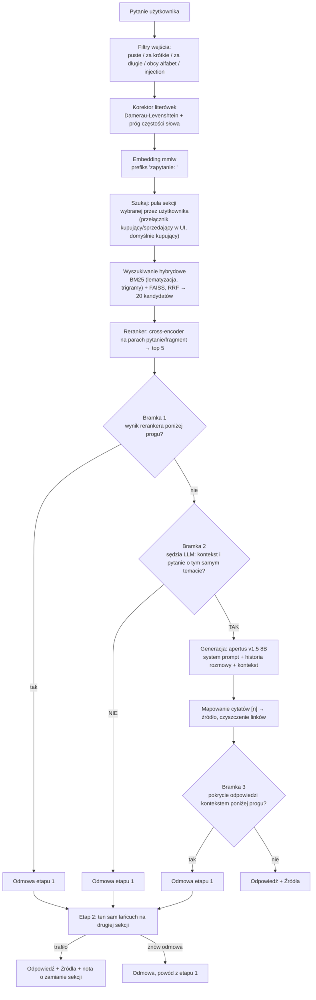

# Chatbot RAG: odpowiedzi wyłącznie z bazy dokumentów

Chatbot, który odpowiada na pytania **tylko na podstawie dostarczonych artykułów**, nigdy z ogólnej wiedzy modelu. Każda odpowiedź ma odnośniki do źródeł. Gdy odpowiedzi nie ma w bazie  system odmawia zamiast zmyślać.

**Demo: [ogflow.pl](https://ogflow.pl)**

Baza testowa: 667 artykułów Allegro Pomoc, dwie sekcje (kupujący, sprzedający) w dwóch językach. Projekt edukacyjny, niezwiązany z Allegro.

---

## W skrócie (stan produkcyjny)

| Co mierzone | Wynik |
|---|---|
| Baza wiedzy | 667 artykułów, 3551 fragmentów: PL 353 art./2109 frag. (184 kupujący, 169 sprzedaż), EN 314 art./1442 frag. (141 kupujący, 173 sprzedaż) |
| Trafność wyszukiwania, top 5 (hit@5) | kupujący PL **0.840** (n=50) · sprzedaż PL **1.000** (n=20) · kupujący EN **0.800** (n=50) · sprzedaż EN **0.947** (n=19) |
| Fałszywe odmowy na bramce pokrycia | PL 0/29 · EN 1/50 |
| Pytania nie na temat złapane (reranker + sędzia LLM) | PL 29/29 · EN 29/29 |
| Testy jednostkowe | **47/47** zielonych, CI na każdym pushu i PR |
| Mediana czasu odpowiedzi (produkcja, Docker) | 6.31 s *(zmierzone z Bielik-11B jako modelem generacji; dzisiejszy model produkcyjny, apertus-v1.5-8b, jest ok. 3x szybszy w samej generacji, pełny pomiar end to end z nim nie powtórzony, patrz sekcja 21)* |
| Model odpowiadający | apertus-v1.5-8b (PL i EN) |

Znany, nienaprawiony problem: trafność kupujący EN (0.800) zostaje ok. 12 punktów procentowych pod sufitem 0.920, bo artykuły o koncie/logowaniu/RODO nakładają się między sekcją kupujących i sprzedających (sekcja 20). Jawny przełącznik strony w UI zamyka tę lukę do zera dla użytkownika, który wie po której jest stronie.

---

## Co to znaczy w praktyce

**Problem, który rozwiązuje.** Chatbot podpięty prosto do modelu językowego nie bazuję na wiedzy od klienta i nie ma określonego sposobu odpowiadania. 

**Jak to jest rozwiązane.** Zanim model cokolwiek napisze, system wyszukuje właściwe fragmenty dokumentów i podaje mu je jako jedyne dopuszczalne źródło. Po wygenerowaniu odpowiedzi sprawdza, czy faktycznie się na nich opiera. Jeśli nie, odmawia odpowiedzi. 
**Trzy niezależne bramki odmowy:**

1. **Przed wyszukiwaniem.** Filtry odrzucają puste, za krótkie, za długie zapytania i podstawowe próby manipulacji promptem.

2. **Przed generacją.** Jeśli żaden fragment nie pasuje wystarczająco, model w ogóle nie jest wołany (oszczędza najdroższy krok). Pytania graniczne ocenia osobne wywołanie modelu: „czy da się na to odpowiedzieć z tego kontekstu, TAK/NIE"

3. **Po generacji.** Sprawdzenie, ile ważnych słów odpowiedzi faktycznie występuje w źródłach. Odpowiedź oderwana od kontekstu jest odrzucana

**Dane mogą nie opuszczać serwera.** Wyszukiwanie, embeddingi i reranking działają lokalnie. Model generujący też może być lokalny, u mnie tak nie jest ze względu na ograniczenia sprzętowe.

---

## Jak to działa

### Dobór technologii

| Element | Wybór | Dlaczego |
|---|---|---|
| Embeddingi | mmlw | Trenowany pod polski, łapie znaczenie lepiej niż model wielojęzyczny |
| Baza wektorowa | FAISS | Lokalna, szybka, wystarcza na tej skali |
| Wyszukiwanie po słowach | BM25 + lematyzacja + trigramy | Sam embedding gubił pytania zbudowane wokół konkretnych słów |
| Reranker | mmarco-mMiniLMv2 (118M) | 26× szybszy od bge-v2-m3 przy stracie jednego trafienia |
| Model odpowiadający | apertus-v1.5-8b | Na pomiarze 25 pytań PL + 25 EN dorównuje lub przewyższa Bielika-11B/Olmo-3-7B jakością (pokrycie kontekstu, brak sprzeczności), bez błędów API, ~3,4× szybszy (patrz `Pomiary/jakosc_modeli.md`, `Pomiary/latencja.md`). Decyzja potwierdzona ponownym pomiarem po utwardzeniu promptu przeciw dublowaniu źródeł: PL remis w granicach szumu, EN i latencja nadal wyraźnie na korzyść apertusa (3,5 razy mniej sprzeczności z kontekstem, ~3× szybszy), patrz `Pomiary/POMIAR_APERTUS_VS_BIELIK.md` |

---

## Kluczowe decyzje: problem → rozwiązanie → wynik

### 1. Samo wyszukiwanie po znaczeniu nie wystarcza

**Problem.** „Jak zmienić hasło" trafiało w artykuł o zmianie waluty. Embedding łapał słowo „zmienić", gubił „hasło".

**Rozwiązanie.** Dołożone wyszukiwanie po słowach (BM25), oba rankingi łączone przez RRF. Potem lematyzacja, żeby BM25 rozpoznawał odmiany słów zamiast wymagać dokładnej formy.

**Wynik.** Na pierwszych 20 pytaniach: 10/20 → 12/20 po dołożeniu BM25, 16/20 po naprawie błędów blokujących. Po lematyzacji na 30 pytaniach: 28/30. 

### 2. Nagłówki w fragmentach

**Problem.** Pierwsza wersja cięła artykuły na równe kawałki po 500 tokenów. Zakładałem, że zachowanie nagłówków da co najwyżej minimalną różnicę.

**Rozwiązanie.** Cięcie po sekcjach, nagłówek doklejany do treści fragmentu (wchodzi do embeddingu, BM25 i rerankera). Wykryty spis treści wycinany. 641 fragmentów zamiast 576, z czego 236 z nagłówkiem.

**Wynik.** Myliłem się: różnica była wyraźna.

| Zestaw | top 3 przed | top 3 po | top 5 przed | top 5 po |
|---|---|---|---|---|
| pytania bez błędów | 0.867 | **0.933** | 0.900 | **0.967** |
| pytania z literówkami | 0.800 | **0.867** | 0.867 | 0.867 |

### 3. Literówki rozwalały wyszukiwanie

**Problem.** Zestaw testowy pisany poprawną polszczyzną, realne pytania nie. Na pytaniach z błędami trafność spadała do 0.700: najsłabszy punkt systemu.

**Rozwiązanie.** Trigramy znakowe w BM25 (dopasowanie po trójkach liter, tolerancyjne na błędy) + korektor Damerau-Levenshtein na słowniku zbudowanym z treści artykułów. Nad korektorem próg częstości słowa: poprawny polski wyraz nie jest ruszany.

**Wynik.** 0.700 → 0.800 (trigramy) → 0.867 (korektor). Trigramy podniosły też czyste pytania z 0.967 do 1.000.

Aktualny pomiar odporności samej warstwy wyszukiwania:

| Zestaw | top 3 | top 5 | czas/zapytanie |
|---|---|---|---|
| bez błędów | **0.860** | **0.940** | 3.24 s |
| z jedną literówką na pytanie | 0.720 | 0.840 | 4.44 s |

### 5. Dzielenie bazy na sekcje szkodziło

**Problem.** Pierwotnie baza była podzielona na trzy sekcje tematyczne, a osobny router zgadywał, w której szukać. Na 20-30 pytaniach wyglądało to dobrze. Podział pierwotnie był robiony w ramach nauki pod przyszłe, rozbudowane projekty. Zdawałem sobie sprawę, że przy tak małej bazie jest to niepotrzebne. 

**Rozwiązanie.** Rozszerzenie zestawu testowego do 61 pytań i porównanie z przeszukiwaniem całej bazy.

**Wynik.** Router przegrywał na każdej osi. Usunięty.

| Tryb | top 5 (61 pytań) | czas/zapytanie | pytania nie na temat odcięte za darmo |
|---|---|---|---|
| router (dwie sekcje) | 0.852 | 4.41 s | 5/29 |
| **cała baza** | **0.918** | **3.33 s** | **7/29** |

Router rankował 40 par (2×20 ze zgadywanych sekcji). Przeszukanie całości daje 20 kandydatów, ale lepiej wycelowanych.

### 6. Żaden pojedynczy próg nie odróżnia pytań granicznych

**Problem.** „Ile Allegro bierze prowizji", „kto jest właścicielem Allegro", „jak założyć sklep". pytania blisko tematu, ale spoza bazy. Rozkłady wyników dla pytań trafnych i nietrafnych nakładają się: 23 z 29 pytań spoza bazy punktuje wyżej niż najsłabsze pytanie z domeny.

**Rozwiązanie.** Próg rerankera przestaje udawać klasyfikator. Jego jedyna rola to tanie odcięcie skrajności przed wywołaniem modelu. Rozróżnianie pytań granicznych przejmuje osobne wywołanie LLM („TAK/NIE, czy da się odpowiedzieć z tego kontekstu").

**Wynik.** Próg poluzowany z −3.2 do −4.3:

| Próg | Fałszywe odmowy | Odcięte za darmo | Wywołań sędziego |
|---|---|---|---|
| −3.2 | 2/61 | 11/29 | 77 |
| **−4.3** | **0/61** | 5/29 | 85 |

Zero fałszywych odmów kosztem 8 dodatkowych wywołań. Tanio, bo sędzia i tak te pytania łapał.

Wybór sędziego:

| Model | Fałszywe odmowy | Nie na temat złapane |
|---|---|---|
| **Bielik-11B** | **2/30** | **17/18** |
| EuroLLM-22B | 5/30 | 18/18 |

Bielik jako kompromis. EuroLLM w rezerwie pod klienta, gdzie „nigdy nie odpowiadaj nie na temat" waży więcej niż okazjonalna fałszywa odmowa. Model sędziego jest odpięty od modelu odpowiadającego, decyzja TAK/NIE jest lżejsza niż generacja, więc może na niej siedzieć tańszy model.

Przy okazji zmiany modelu odpowiadającego na apertus-v1.5-8b (patrz tabela wyboru technologii wyżej) sprawdzono też apertusa w roli sędziego: falszywe odmowy porównywalne (PL 1/50 vs 1/50, EN 0/50 vs 3/50 na korzyść apertusa), ale zlapane OOD wyraźnie gorsze (22/29 vs 28/29 PL, 22/29 vs 27/29 EN), czyli realna regresja bramki antyhalucynacyjnej. Sędzia zostaje przy Bielik-11B (PL) i Olmo-3-7B (EN), niezależnie od modelu odpowiadającego (patrz `Pomiary/sedzia_modele.md`).

### 7. Bramka antyhalucynacyjna wyrzucała dobre odpowiedzi

**Problem.** Z 24 odmów w symulacji 100 pytań aż 7 padło **po** generacji (877 zmarnowanych tokenów), w tym dwie na w pełni trafnych pytaniach. Wyszukiwanie trafiło właściwy artykuł na pierwsze miejsce, model odpowiedział poprawnie i odpowiedź została odrzucona. Przyczyna: model parafrazuje słowami spoza kontekstu („weryfikacja", „tożsamość" przy pytaniu o odzyskanie konta), więc pokrycie leksykalne spada mimo trafności.

**Rozwiązanie.** Rekalibracja progu pokrycia z 0.40 na 0.20, na rozkładzie 29 pytań wieloczłonowych z domeny vs 29 spoza.

|  | min | mediana | max |
|---|---|---|---|
| pytania z domeny | 0.253 | 0.690 | 0.885 |
| pytania spoza | 0.042 | 0.228 | 0.651 |

**Wynik.**

| Próg | Fałszywe odmowy |
|---|---|
| 0.40 | 4/29 |
| **0.20** | **0/29** |

Wybrany 0.20, nie 0.25: najniższe trafne pytanie ma 0.253, a generacja jest lekko losowa (rozrzut 0.01–0.03). 0.25 zostawiłby margines 0.003. 0.20 daje 0.05 i wciąż reaguje na tekst bez oparcia w źródłach.

### 8. Błąd w danych zdiagnozowany po czasie odmowy

**Problem.** Pytanie „Sprzedawca chce, żebym zapłacił poza Allegro, czy to bezpieczne?" było stabilnie odrzucane, mimo że jest z domeny.

**Rozwiązanie.** Czas odmowy wskazuje bramkę bez zaglądania w kod: <1 s to filtr wejścia, ~2.9 s to próg rerankera, ~6.3 s to sędzia. To pytanie padało po ~6.3 s, czyli sędzia dostawał zły kontekst.

**Wynik.** Właściwy artykuł miał etykietę `konto` zamiast `zakupy`, więc nigdy nie trafiał do puli kandydatów. Naprawa: jedna linia mapowania + przeniesienie 3 artykułów. Kontrola regresji: trafność bez zmian (0.900/0.933).

### 9. Reguła z jednej kategorii podana jako uniwersalna

**Problem.** Na ogólne pytanie o zwrot paczki (bez słowa „alkohol") bot podawał progi wagowe 20 kg / 31,5 kg jako ogólną zasadę zwrotów. W rzeczywistości progi pochodzą z artykułu o kategorii Alkohol i dotyczą tylko jej. Przyczyna: prompt dostawał samą treść chunku, bez tytułu artykułu, z którego pochodzi, więc model nie miał jak rozpoznać, że reguła jest zawężona do jednej kategorii.

**Rozwiązanie.** Każdy blok źródła w kontekście dostaje teraz nagłówek z tytułem artykułu (`[1] Jakie są zasady zakupów i dostawy w kategorii Alkohol\n...`), a prompt grounding wprost zabrania przenoszenia reguł z konkretnej kategorii na sytuację ogólną. Zmiana wspólna dla ścieżki PL i EN.

**Wynik.** Na pytaniu odtwarzającym incydent („chcę zwrócić zamówienie, ale nie wiem ile waży moja paczka") system przestał podawać progi jako uniwersalne (`True → False`) i zamiast tego trafnie odmawia, bo dostępny kontekst dotyczy tylko innej kategorii. Kontrola regresji na 50 pytaniach golden + 29 OOD (sędzia) i 12 pytaniach z `pipeline.pytania` (cytaty `[n]`): bez regresji. Pełny log: `src/POMIAR_ROUTING.md`, sekcja 17.

### 10. Wieloturowość przez przepisanie zapytania, nowy asystent maila reklamacyjnego

**Problem.** Dopytania w rozmowie były sklejane prostą konkatenacją poprzedniej wypowiedzi z nowym pytaniem, co czasem dawało zapytanie do wyszukiwarki gorsze niż samodzielnie sformułowane. Bot też kończył zawsze na odpowiedzi, nigdy nie proponował konkretnej akcji, mimo że część pytań (reklamacja, sprzedawca nie odpowiada) prosi się o gotowy szkic wiadomości.

**Rozwiązanie.** Dopytania rozpoznane tanim detektorem (`followup`) są teraz przepisywane przez LLM na samodzielne pytanie (`przepisz_zapytanie`) zamiast sklejane. Osobno: nowy tryb generuje szkic maila reklamacyjnego do sprzedawcy, ugruntowany w artykule o Dyskusji z Centrum Pomocy, z placeholderami zamiast zmyślonych numerów zamówień i dat. Wyzwalany hybrydowo: tani regex na słowa klucze bramkuje jedno wywołanie LLM-sędziego (`czy_oferowac_mail`), które decyduje, czy zaproponować pomoc, plus tani fallback na wyraźną prośbę.

**Wynik.** Pary wieloturowe: trafność w źródło startowego pytania 40%→60% (n=10). Bramka i sędzia oferty: 6/6 trafnych decyzji na oznaczonym zestawie, 0/100 fałszywych trafień jawnej prośby na golden. Jakość szkicu maila (sędzia LLM, rubryka 1-5): średnia 4,5/5. Regresja end-to-end na 50 golden na język: bez zmian ponad znany szum losowości generacji (sekcja 13). Przy okazji znaleziony i naprawiony pre-istniejący błąd retrievalu (zapytanie „reklamacja” nie trafiało w artykuł, który używa terminu „Dyskusja”) oraz błąd renderowania przycisku oferty w Streamlit (widget wewnątrz warunkowego bloku nigdy nie rejestrował kliknięcia). Pełny log: `src/POMIAR_ROUTING.md`, sekcja 19.

### 11. Sprawdzalność: siatka testów jednostkowych i porządek w wczytywaniu modeli

**Problem.** Logika filtrów wejścia i korektora literówek miała pokrycie tylko przez end to end pomiary na golden set, bez testów samych funkcji. Osobno: przy uruchomieniu pomiarów w tym samym procesie co pipeline, model embeddingów mmlw wczytywał się dwukrotnie, raz we własnym pliku pomiarowym i raz w pipeline.

**Rozwiązanie.** Dwadzieścia dwa testy jednostkowe (pytest) dla filtrów wejścia (za krótkie, za długie, obcy alfabet, wykrywanie prób wstrzyknięcia promptu wraz z wariantami leet) oraz dla korektora literówek (detekcja języka, dopasowanie do słownika korpusu, odległość edycyjna). Plik pomiarowy przestał tworzyć własną instancję modelu i korzysta teraz z tej samej instancji co pipeline.

**Wynik.** 22/22 testów zielonych. Kontrola regresji: trafność wyszukiwania na golden set bez zmian (0,820, te same pudła co przed zmianą), model w pliku pomiarowym i w pipeline to teraz jeden obiekt w pamięci zamiast dwóch.

### 12. Cache odpowiedzi, obserwowalność produkcji i docinanie sędziego

**Problem.** Częste pytania generowały odpowiedź od nowa za każdym razem (kilka do kilkunastu sekund, plus koszt API), mimo że treść odpowiedzi jest deterministyczna dla tego samego pytania i tego samego stanu korpusu. Osobno: brak było wglądu w to, co dzieje się na produkcji, odsetek odmów, rozkład latencji, które sekcje są pytane. Pomiar end-to-end (`measure_e2e`) pokazał też, że część golden pytań kończy się odmową mimo trafnego kontekstu w retrievalu, bo sędzia LLM oceniał kontekst zbyt surowo.

**Rozwiązanie.** Cache odpowiedzi w `api.py`, kluczowany znormalizowanym pytaniem, językiem i stemplem mtime korpusu (przebudowa bazy wiedzy unieważnia cache automatycznie), tylko dla udanych odpowiedzi i tylko dla samodzielnych pytań bez historii rozmowy. Log strukturalny JSONL po każdym zapytaniu (język, sekcja, wynik, latencja, trafienie cache), z redakcją PII tym samym mechanizmem co istniejący filtr `skazone_tokeny`. Strona analityczna w Streamlit z odsetkiem odmów, medianą latencji i top pytaniami. Prompt sędziego PL dociągnięty o wyraźne „nie sprawdzasz kompletności" i „wystarczy jedno pasujące źródło z kilku". Ta sama zmiana wypróbowana też dla EN, ale zmierzona jako gorsza w trzech przebiegach, więc tam wycofana.

**Wynik.** Cache: pierwsze zapytanie 10,4 s, drugie (z cache) 0,28 s, identyczna treść. Sędzia: PL 46/50 → 50/50 golden przechodzi end-to-end (zero odmów), zmiana promptu zostaje. Dla EN ta sama zmiana zmierzona trzykrotnie nie pomogła (43 → 42 → 41/50), więc została wycofana, pozostała luka to realny problem w treści korpusu albo embedderze EN, nie w prompcie. Kontrola OOD (6 pytań spoza domeny) bez regresji.

### 13. CI na GitHub Actions

**Problem.** Testy jednostkowe istniały tylko lokalnie, nic nie pilnowało, żeby zostały zielone przy każdej zmianie. Trzy testy korektora literówek (`correct()`) czytały słownik z `RAG/`, katalogu który w repo nie istnieje, więc te same testy w CI padłyby mimo że lokalnie przechodziły.

**Rozwiązanie.** Autouse fixture w `tests/conftest.py` wstrzykuje mały słownik zamiast czytać `RAG/`, testy `correct()` są teraz hermetyczne. Testy jednostkowe przestały być prywatne (świadoma zmiana konwencji: były w `.gitignore`, teraz są scommitowane, bo GitHub Actions potrzebuje ich w checkout, żeby cokolwiek sprawdzić). Workflow `.github/workflows/ci.yml` uruchamia `ruff check` i `pytest` na każdym pushu i pull requeście, bez ciężkich zależności (`torch`/`faiss`/`sentence-transformers`).

**Wynik.** 22/22 testów zielonych z fixture, hermetycznie. `ruff check src tests` czyste po naprawie trzech niejednoznacznych nazw zmiennych (`l`, `I`) w `chunking.py`/`rankings.py`, kontrola regresji: trafność wyszukiwania na golden set bez zmian (0,820).

### 14. Cztery kategorie maila zamiast jednej, jeden sędzia-router zamiast TAK/NIE

**Problem.** Asystent akcji umiał wygenerować tylko jeden rodzaj wiadomości: mail reklamacyjny do sprzedawcy, oceniany binarnym sędzią LLM (TAK/NIE, czy zaoferować pomoc). Realne potrzeby kupującego są szersze: chęć zwrotu bez wady towaru, prośba o fakturę, zgłoszenie że sprzedawca w ogóle nie odpowiada.

**Rozwiązanie.** Sędzia binarny zastąpiony jednym sędzią-routerem LLM, który wybiera jedną z pięciu etykiet: `REKLAMACJA`/`ZWROT`/`FAKTURA`/`ESKALACJA`/`NONE`. Dane każdej kategorii (artykuł groundujący, zapytanie do retrievalu, kanoniczny tekst oferty, słowa/frazy taniej bramki) trzymane centralnie w konfiguracji językowej. Osobny prompt generujący szkic dla każdej kategorii, z tymi samymi regułami co dotychczas (placeholdery zamiast zmyślonych danych, proces wyłącznie z kontekstu źródłowego).

**Wynik.** Pierwszy przebieg pomiaru: 5/12 trafnych kategorii, bo cheap-gate sprawdzana na pytaniach proceduralnych nadmiernie liberalna, a mini-retrieval kontekstu dla routera w ścieżce wolnego tekstu czasem trafiał w niezwiązany artykuł. Po dociągnięciu promptu routera (jawna granica pytanie-proceduralne-vs-własna-sytuacja) i rozszerzeniu kontekstu retrievalu (ostatnia wiadomość z historii zamiast samego polecenia, `k` z 3 do 5): **12/12 trafnych kategorii, 12/12 trafnych bramek**, jakość czterech szkiców (PL/EN) 8/8 poprawna kategoria, średnia ocena 4.0-4.4/5 w zależności od przebiegu (wariancja po stronie generacji EN, znana i wcześniej odnotowana słabość, nie routingu). Zero nowych fałszywych trafień na golden (0/100), ta sama krytyczna bramka co przy jednej kategorii.

### 15. Frontend w Next.js obok Streamlita, streaming przez proxy Route Handler

**Problem.** Streamlit sprawdza się jako szybkie demo, ale pod portfolio i realne wdrożenie potrzebny jest frontend z pełną kontrolą nad UX, bez zmiany backendu, który pozostaje jedynym źródłem prawdy.

**Rozwiązanie.** Nowy katalog `frontend-next/` (App Router, TypeScript, Tailwind, komponenty własne, bez shadcn), działający obok `frontend/app.py` do czasu pełnego parytetu. Przeglądarka nie łączy się z FastAPI bezpośrednio: `app/api/chat/route.ts` robi serwerowy fetch do `FASTAPI_URL/chat/stream` i oddaje strumień dalej, więc jeden origin, zero CORS, adres backendu nieujawniony w przeglądarce. Kontrakt SSE (`krok`/`token`/`wynik`/`blad`), reguły historii (dopisywana tylko przy udanej odpowiedzi), retry po negacji i oferta maila z kategorią odwzorowane z `frontend/app.py` jeden do jednego.

**Wynik.** Weryfikacja end-to-end w przeglądarce: pytanie RAG PL i EN streamuje tokeny i kończy renderem z `wynik.dane.answer`, przycisk oferty generuje poprawny szkic z nagłówkiem właściwym dla kategorii (np. „Szkic maila reklamacyjnego"), doprecyzowanie po literówce pokazuje baner i poprawne „nie" wraca do oryginalnego pytania bez ponownej pętli korekty. Pomiar parytetu (`src/measure_frontend.py`, 8 zapytań PL/EN: RAG, oferta, jawna prośba o mail, literówka, odmowa) między proxy a bezpośrednim wywołaniem `/chat/stream`: **8/8 zgodnych** pól `agent`/`tryb`/`oferta`. Narzut samego proxy zmierzony osobno na rozgrzanym cache (żeby oddzielić go od wariancji czasu generowania): mediana **21.7ms**, pomijalny.

### 16. Twardość backendu: testy krytycznych miejsc, większa próba wieloturowa, cache embeddingu, pomiar wierności

**Problem.** Rdzeń RAG miał zieloną baterię pomiarów, ale przegląd pod kątem twardości (nie nowej funkcji) pokazał pięć słabych miejsc: pokrycie leksykalne mylone z wiernością odpowiedzi, wieloturowość mierzona na zbyt małej próbie (10 par), brak świadomej pętli optymalizacji latencji, brak testów jednostkowych na krytycznych funkcjach (mapowanie cytatów, bramka pokrycia, router maili) i jeden 507 liniowy plik `agents.py` mieszający generację, sędziów i maile.

**Rozwiązanie.** Pięć niezależnych punktów, każdy zamknięty testem albo pomiarem, opisanych w `pomiary/PLAN_TWARDOSC_BACKEND.md`. Trzy nowe pliki testów jednostkowych (`test_verify_answer.py`, `test_pokrycie.py`, `test_router_mail.py`), zero wywołań LLM. Zestaw wieloturowy rozszerzony z 10 do 30 par (proporcjonalnie PL/EN, siedem różnych intencji). Cache embeddingu zapytania (`functools.lru_cache`) dla powtarzalnych zapytań, potwierdzenie pomiarem że rozgrzanie rerankera przy starcie serwera już działa, i realny test hipotezy „mniejszy model sędziego da niższą latencję" (odrzucona liczbami, nie przyjęta na wiarę). Nowy pomiar faithfulness: sędzia LLM ocenia każdą odpowiedź golden pod kątem twierdzeń sprzecznych z kontekstem, osobno od taniej bramki pokrycia leksykalnego. `agents.py` rozbity na cztery moduły (`agents_core`, `agents_generacja`, `agents_sedzia`, `agents_mail`) plus cienka fasada, żeby żaden istniejący import się nie zmienił.

**Wynik.** 42/42 testów zielonych (20 nowych). Wieloturowość: 22/30 do 24/30 po naprawie realnego braku w detektorze follow-up dla angielskiego („what if" nie było rozpoznawane), bez regresji. Cache embeddingu: mediana 67.7ms do 0.0ms na trafieniu. Mniejszy model sędziego zmierzony jako prawie czterokrotnie wolniejszy na dostępnym endpointcie, więc odrzucony i nie wdrożony. Faithfulness: 30/30 odpowiedzi golden bez wykrytych sprzeczności z kontekstem w tym przebiegu, pomiar diagnostyczny do powtarzania przy większych zmianach promptu. Refaktor `agents.py`: sanity import i cały zestaw testów bez zmian, zero zmiany treści promptów ani logiki. Pełne logi: `pomiary/POMIAR_MULTITURA.md`, `pomiary/POMIAR_LATENCJA.md`, `pomiary/POMIAR_FAITHFULNESS.md`, `pomiary/POMIAR_REFAKTOR_AGENTS.md`.

### 17. Poprawki ze zgłoszeń z demo: prompty, fallback modelu, front czatu i panelu maila

**Problem.** Realne użycie dema pokazało 17 usterek w trzech warstwach: martwe linki markdown w odpowiedzi (`[tutaj]()` po wycięciu URL), mail domyślnie w formie męskiej i jako bryła tekstu, odpowiedź na ogólne pytanie zawężona do jednego przypadku szczególnego (np. Allegro Smart), zbędny krok SSE migający nawet gdy oferta maila nie padnie, brak fallbacku gdy model główny odpowie błędem, front bez streamingu tokenów (odpowiedź pojawiała się dopiero na końcu), `[n]` w tekście nieklikalne, lista źródeł pokazująca wszystkie odzyskane chunki zamiast tylko cytowanych, surowe URL-e zamiast czytelnych tytułów, zamknięty panel maila bez możliwości ponownego otwarcia, „Regeneruj" kosztownie odpytujące model zamiast po prostu cofać edycję, martwy przycisk „Zapisz szablon", brak flagi przy przełączniku języka.

**Rozwiązanie.** Backend (`agents_core.py`, `agents_generacja.py`, `pipeline.py`): nowa funkcja `zwin_linki_markdown` czyszcząca martwe linki przed cięciem URL, prompty `email_system_*` (PL/EN, cztery kategorie) dopisane o neutralność rodzajową i podział na akapity, `grounding` dopisany o kolejność „ogólne przed szczególnym", usunięty zbędny krok SSE, `MODEL_FALLBACK` z retry na model zapasowy w `answer`/`answer_stream` przy wyjątku modelu głównego. Front (`frontend-next/`): obsługa zdarzenia SSE `token` z podmianą na finalny `dane.answer`, `[n]` zamieniane na klikalny markdown-link do źródła, `lib/zrodla.ts` wyprowadza czytelny tytuł ze slugu URL, lista źródeł budowana z `citations` zamiast `sources`, panel maila trzyma ostatni szkic po zamknięciu (przycisk „Otwórz szkic wiadomości"), „Cofnij edycje" przywraca zapamiętaną oryginalną treść bez wywołania API, usunięte „Zapisz szablon", flaga PL/UK przy przełączniku języka.

**Wynik.** 42/42 testów backendu zielonych, `ruff` czysto, `ocena_stylu` bez regresji (4.33 → 4.67 na próbce). Fallback modelu potwierdzony żywym testem z wymuszonym błędem 403 na modelu głównym: odpowiedź i tak wygenerowana. Po drodze w przeglądarce znaleziony i naprawiony realny bug: reopen panelu pokazywał pusty edytor, bo `contentEditable` był warunkowo odmontowywany i tracił synchronizację z odtworzonym stanem, mimo że stan Reacta był zachowany. `tsc`/`eslint` czysto. Pełne logi: `pomiary/POMIAR_PROMPTY_MAIL.md`, `pomiary/POMIAR_FALLBACK.md`, `pomiary/POMIAR_17_ZGLOSZEN_FRONT.md`.

### 18. Druga runda zgłoszeń z demo: rozmowy równoległe, kategoria eskalacji, temat maila, strona o danych, dopracowanie EN, wspólny kontrakt formatu

**Problem.** Kolejna runda testów dała osiem zgłoszeń. Front blokował wysyłkę w drugim wątku rozmowy dopóki pierwszy strumień nie skończył (pojedynczy globalny boolean zamiast stanu per wątek). Zgłoszenie „paczka nie przyszła" nie generowało oferty maila, bo kategoria eskalacji łapała tylko brak reakcji sprzedawcy, nie brak przesyłki. Panel edycji maila czasem zostawał z pustym tematem, gdy model pominął albo sformatował inaczej linię „Temat:". Podstrona `/prywatnosc` była zaślepką z jednym zdaniem. Angielska ścieżka miała trzy osobne usterki: krok streamingu pokazywał surową wewnętrzną nazwę sekcji (`section: konto`), model czasem przepisywał pojedyncze polskie słowa z tłumaczonego korpusu, a jedna z podpowiedzi na start rozmowy kończyła się odmową. Trzy persony odpowiadającego miały sprzeczne, wprost skonfliktowane instrukcje formatu (kroki vs akapity vs bez wstępu), więc odpowiedzi wyglądały niespójnie między sekcjami.

**Rozwiązanie.** Front (`ChatApp.tsx`): stan wysyłki zamieniony z pojedynczego boola na `Set<string>` id wątków, każdy strumień z własnym `AbortController`. Backend (`lang_config.py`): frazy kategorii eskalacji rozszerzone o warianty braku dostawy PL/EN. Temat maila: tolerancyjny regex w `rozdzielSzkic` (wiodące spacje, `#`, `**`), zapasowy nagłówek z nowego pola `ChatResponse.naglowek_ui`, i jawna instrukcja formatu `Temat:`/`Subject:` we wszystkich ośmiu promptach maila. Podstrona `/prywatnosc` przepisana na pełną, dwujęzyczną treść opartą na faktach z kodu (co idzie do dostawcy LLM, co zapisuje log, czego nie zapisuje, limity, jak usunąć dane), w liczbie pojedynczej. EN: nowa mapa nazw sekcji w `lang_config.py`, ostrzeżenie w grounding EN przed przepisywaniem polskich fragmentów z kontekstu, nowa stała bramka pomiarowa sprawdzająca że żadna podpowiedź z frontendu nie kończy się odmową. Kontrakt formy (bez preambuły meta, jedno zdanie wstępu, kroki albo akapity w jednej konwencji, bez nagłówków markdown) przeniesiony ze sprzecznych person do wspólnego `grounding`, persony zostały tylko z tonem.

**Wynik.** 47/47 testów zielonych, `ruff` czysto. Backend na dwóch równoległych strumieniach: 1.33× przyspieszenie względem sekwencyjnego wykonania (ani pełna serializacja, ani pełna równoległość, zgodnie z hipotezą o GIL i pracy sieciowej). Oferta maila po „paczka nie przyszła"/„order never arrived": zero przed poprawką, poprawna po, bez regresji na golden (0/100 fałszywych trafień jawnej prośby). Format: na 93 odpowiedziach golden PL+EN zero nagłówków markdown i podobny rozkład formy między sekcjami, ale preambuła meta nie zeszła do zera (17/93, 18%), model częściowo nie przestrzega jawnego zakazu w prompcie, zmierzony i udokumentowany otwarty wynik, nie fałszywie zaraportowany jako sukces. Podpowiedzi frontendu: 19/20 kończy się odpowiedzią, jeden EN przypadek („I suspect my account was hacked") wciąż kończy się odmową z powodu realnej luki w jakości wyszukiwania korpusu EN dla tego tematu (istnieje trafny odpowiednik w PL, w EN nie trafia w top wyników), zostawione jako znane ograniczenie do osobnego planu, nie naprawiane doraźną zmianą promptu. Pełny log: `Pomiary/POMIAR_POPRAWKI_RUNDA3.md`.

### 19. Sekcja dla sprzedających: druga połowa Centrum Pomocy Allegro

**Problem.** Baza wiedzy pokrywała wyłącznie Centrum Pomocy dla kupujących. Każde pytanie sprzedawcy (jak wystawić ofertę, jak dodać fakturę i stawkę VAT, jak działa One Fulfillment, kiedy przyjdą pieniądze za sprzedaż) kończyło się odmową, mimo że odpowiedni artykuł istnieje na `help.allegro.com/{pl,en}/sell`, w zupełnie osobnym serwisie.

**Rozwiązanie.** Nowy scraper (`links_scraping_sprzedaz.py`) odkrywa kategorie przeszukiwaniem wszerz po stronach departamentów serwisu (135 kategorii, w pełni programowo, bez ręcznie utrzymywanej listy), pobiera treść zwykłym `httpx`, ta sama metoda co dla kupujących, sterowanie przeglądarką okazało się niepotrzebne wbrew wcześniejszemu założeniu. Nowy `scal_korpus.py` dokleja chunki sprzedaży za chunkami kupujących z asercją, że istniejące pozycje i wektory zostają nietknięte. `embedder.py` dostał tryb `--dopisz`: koduje tylko nowe chunki zamiast całego korpusu od nowa. Nowa persona `sprzedaz` (ton rzeczowy, biznesowy) i rozszerzony zakres tematyczny sędziego LLM.

**Wynik.** 169 artykułów PL (1287 fragmentów) i 173 artykuły EN (801 fragmentów) dołożone bez naruszenia istniejących 822 (PL) i 641 (EN) fragmentów kupujących. Nowa sekcja w pełni odnajdywalna: hit@5 = 1,000 na nowym golden secie (20 pytań PL, 19 EN). Regresja na pytaniach kupujących: hit@5 PL bez zmian (0,840), hit@5 EN spadło z 0,920 do 0,800. Przyczyna zmierzona wprost: sekcje kupujących i sprzedających realnie konkurują o miejsce w top 5 (średnio 30% PL i 41% EN miejsc na pytaniach kupujących trafia teraz w chunk sprzedażowy), bo Allegro opisuje konto, logowanie i RODO niemal równolegle dla obu grup odbiorców. To potwierdza przewidywane ryzyko: najważniejszym następnym krokiem jest jawny routing pytań między sekcją kupujących i sprzedających, nie poleganie wyłącznie na wspólnym indeksie i rerankerze. Progi bramek (`prog_rerank`, `prog_pokrycia`) sprawdzone po scaleniu i pozostawione bez zmian, IDF się przesunęło, ale nie na tyle, żeby zagrozić trafnym pytaniom. Pełny log z liczbami: `Pomiary/POMIAR_SEKCJA_SPRZEDAJACY.md`.

### 20. Routing kupujący / sprzedający: dwie odrzucone wersje, jedna wdrożona

**Problem.** Kontynuacja rekomendacji z sekcji 19: sekcje kupujących i sprzedających realnie konkurują o miejsce w top 5, więc pytania kupujących coraz częściej trafiają w artykuł ze złej sekcji.

**Pierwsza próba, odrzucona pomiarem.** Zgodnie z planem: przy braku sygnału o stronie pytania system i tak wymuszał jedną stronę, porównując surowy wynik rerankera między pulą kupujących a sprzedających. Zmierzone: hit@5 kupujący PL spadł do 0,540, EN do 0,600, gorzej niż stan przed tą zmianą. Druga wersja z sumą trzech najlepszych wyników zamiast jednego nie poprawiła sytuacji (kupujący EN nawet spadł do 0,560). Przyczyna: sygnał leksykalny albo kontynuacji rozmowy pokrywa tylko od 10 do 26% pytań, więc dla większości ruchu system i tak zgadywał stronę wyłącznie po wyniku rerankera, na dokładnie tych samych bliźniaczych artykułach o koncie i logowaniu, które już wcześniej myliły ranking.

**Wdrożona wersja.** Routing i homogenizacja kontekstu do jednej strony włączają się wyłącznie, gdy jest realny sygnał: jawna deklaracja w interfejsie, kontynuacja rozmowy albo trafiony marker leksykalny w pytaniu. Bez żadnego z tych sygnałów system przeszukuje cały korpus dokładnie tak, jak przed tą zmianą, bez zgadywania strony.

**Wynik.** Kupujący PL: hit@5 = 0,840, bramka planu spełniona. Sprzedaż PL: hit@5 = 1,000, sufit. Kupujący EN: hit@5 = 0,800, parytet z dzisiejszą produkcją, bez powrotu do 0,920 sprzed scalenia korpusu sprzedających, bo większość pytań EN nie ma żadnego sygnału. Sprzedaż EN: hit@5 = 0,947, minus jedno pytanie względem stanu sprzed tej zmiany. Zero pytań zwrotnych na wszystkich czterech zestawach golden. Największa realna wartość zmiany to jawny przełącznik w panelu bocznym (Auto, Kupuję, Sprzedaję): darmowy, zerowego ryzyka, domyka całą lukę do sufitu dla użytkownika, który wie, po której jest stronie. Pełny log z liczbami, dwiema odrzuconymi wersjami i siatką kalibracji: `Pomiary/POMIAR_ROUTING_STRONY.md`.

### 21. Czwarty sygnał routingu: klasyfikator LLM, zmierzony i odrzucony

**Problem.** Od 74 do 90% pytań golden nie dostaje żadnego sygnału strony (sekcja 20) i trafia do wspólnej puli `all`. Hipoteza: tani, jednosłowny klasyfikator LLM (KUPUJACY / SPRZEDAJACY / NIEPEWNE) jako czwarty sygnał mógłby domknąć lukę kupujący EN (0,800 wobec sufitu 0,920).

**Rozwiązanie.** Dwuetapowy pomiar. Etap 1: klasyfikator sam w sobie, cztery iteracje promptu, porównanie modeli. Po drodze naprawione dwa realne bugi w kodzie produkcyjnym (`max_tokens=6` obcinający etykietę „SPRZEDAJACY" do niedopasowanej formy, limit 100 wywołań/min na koncie dostawcy) i dodany fallback na apertus przy awarii modelu głównego. Apertus i Olmo jako klasyfikator nie przeszły nawet obniżonych bramek etapu 1, Bielik-11B przeszedł (pokrycie średnie 0,493, precyzja 0,90 do 1,00, mediana latencji 0,74 s). Etap 2: klasyfikator wpięty end to end za flagą `KLASYFIKATOR_STRONY`, zestrojony na 162-punktowej siatce kalibracji.

**Wynik.** Etap 2 nie przeszedł.

| | hit@5 bez klasyfikatora | hit@5 z klasyfikatorem | bramka |
|---|---|---|---|
| kupujący PL | 0,840 | 0,840 | przeszła |
| sprzedaż PL | 1,000 | 1,000 | przeszła |
| kupujący EN | 0,800 | **0,760** | **nie przeszła** (cel co najmniej 0,860) |
| sprzedaż EN | 0,947 | **0,895** | **nie przeszła** (cel co najmniej 0,947) |

Jedyna metryka, dla której ten eksperyment powstał (kupujący EN), spadła zamiast wzrosnąć, sprzedaż EN dostała nową regresję, a latencja PL wzrosła o 52,4% (bramka poniżej 25%). Klasyfikator zawęża pulę kandydatów skuteczniej niż wcześniej, ale to zawężenie częściej wypycha właściwe źródło poza top 5, niż je chroni, zwłaszcza po stronie EN.

**Decyzja: klasyfikator zostaje wyłączony**, `KLASYFIKATOR_STRONY` pozostaje na domyślnym `0`, bez zmiany na produkcji. Kod zostaje w repo jako gotowa, przetestowana, domyślnie wyłączona infrastruktura, na wypadek przyszłej rewizji promptu albo innego modelu. Przy okazji znaleziony, osobny i wciąż niezamknięty problem: `strony.rozstrzygnij()` potrafi odwrócić poprawny prior leksykalny, gdy surowy wynik rerankera dla drugiej strony przewyższa bonus prioru, niezależnie od tej flagi. Pełny log: `Pomiary/POMIAR_KLASYFIKATOR_STRONY.md`.

### 22. Panel maila: stan wysłano, porzucenie szkicu, okno cofnięcia, korekta, kontekst po wysyłce

**Problem.** Pięć zgłoszeń z demo naraz. Po wysyłce numer zgłoszenia znikał razem z toastem, drugie kliknięcie „wyślij" było dalej aktywne, a w rozmowie nie zostawał żaden ślad, że mail w ogóle poszedł. Szkicu nie dało się porzucić, panel po zamknięciu wracał tylko przez pigułkę „otwórz szkic". Wysyłki nie dało się cofnąć, mimo że to jedyna nieodwracalna akcja w całej aplikacji. Po wysłaniu nie było jak poprawić literówki bez tworzenia osobnego, niepowiązanego zgłoszenia. Najpoważniejsze: kolejna tura po mailu traciła kontekst rozmowy, bo `agent: 'email'` (wartość spoza sekcji korpusu) trafiał do `agent_poprzedni`, a `prior_strony` mapuje wszystko, co nie jest `'sprzedaz'`, na `'kupujacy'`: rozmowa zostawała przyklejona do złej strony przy kolejnym pytaniu z sygnałem kontynuacji.

**Rozwiązanie.** Front (`ChatApp.tsx`, `EmailPanel.tsx`, `threads.ts`, `chat.ts`): stan panelu dostał pola `wyslano` (ticket i godzina, widoczne w nagłówku panelu i jako osobna wiadomość w wątku), `edytujPoWyslaniu` i `odliczanieDo`. Wysyłka nie woła już `fetch` od razu: klik na „Wyślij" startuje 15-sekundowe okno z paskiem „wysyłam za N s" i przyciskiem „cofnij" (wzorem Gmaila), dopiero po jego upływie leci żądanie; odświeżenie strony w trakcie okna anuluje wysyłkę, bo timer żyje w pamięci karty, i to świadomy kompromis, nie przeoczenie. Po sukcesie panel przechodzi w tryb tylko do odczytu z przyciskiem „wyślij poprawioną wersję", który odblokowuje edycję i przy ponownej wysyłce dokłada pierwotny ticket do żądania. Osobny przycisk „porzuć szkic" w nagłówku (odróżniony od „zamknij") czyści panel, z potwierdzeniem tylko gdy jest co stracić; wiadomość z numerem zgłoszenia zostaje w wątku, bo zgłoszenie u sprzedawcy istnieje niezależnie od tego, co user widzi u siebie. Backend (`api.py`, `wysylka.py`, `lang_config.py`): pole `ticket` w żądaniu `/send-email`, gdy podane, `wyslij_potwierdzenie` używa go zamiast losować nowy i temat dostaje przedrostek korekty; wyjątek od cooldownu adresu dla żądań z ticketem, ale najwyżej raz na ticket (rejestr `_korekty`), a sam adres i tak zostaje odświeżony w cooldownie, żeby korekta nie otwierała furtki do pominięcia limitu zwykłym żądaniem zaraz potem. Naprawa kontekstu: front nie ustawia już `ostatniAgent` na `'email'` (warunek `dane.agent !== 'email'`), a do historii idzie jednozdaniowe streszczenie zamiast pełnego szkicu, żeby kolejna tura niosła fakt, nie treść.

**Wynik.** `pytest tests -q`: 78/78 zielonych (rozszerzone `tests/test_wysylka.py` o korektę z ticketem). `ruff check src`: bez zastrzeżeń. Weryfikacja end to end w przeglądarce (PL i EN): stan wysłano, porzucenie szkicu z potwierdzeniem, okno cofnięcia bez żadnego żądania sieciowego przy kliknięciu „cofnij" (potwierdzone w zakładce sieci), korekta z tym samym numerem zgłoszenia, wszystko zgodne z projektem. Pomiar rozdzielający oba czynniki utraty kontekstu (`Pomiary/measure_mail_ux.py`, n=6 na cztery golden sety, dwa niezależne przebiegi): sam sygnał `agent_poprzedni` ma efekt tylko na pytaniach rozpoznanych jako kontynuacja rozmowy (mniejszość próby), bo wcześniejsza poprawka lepkości (sekcja 20) już ogranicza go do tego przypadku. Na sprzedaz_pl i sprzedaz_en efekt jest odtwarzalny w obu przebiegach: trafność strony rośnie po naprawie (0,83→1,00 i 0,67→0,83). Na kupujacy_en zero różnicy w obu przebiegach, bo żadne z golden pytań nie jest tam rozpoznawane jako kontynuacja. Na kupujacy_pl wynik jest niejednoznaczny przy tak małym n: naprawa nigdy nie wypada gorzej niż błąd sprzed niej, ale w jednym z dwóch przebiegów wypadła gorzej niż tura bez żadnego maila wcześniej, różnica rzędu jednego pytania na sześć, nieodróżnialna od szumu generacji LLM bez większej próby. Zgłoszone wprost jako otwarte, nie ukryte pod korzystniejszą liczbą. Pełny log z liczbami z obu przebiegów: `Pomiary/POMIAR_MAIL_UX.md`.

---

## Bezpieczeństwo i odporność

**Ochrona przed manipulacją promptem.** Filtry wejścia odrzucają znane wzorce, ale realną obroną jest oparcie odpowiedzi na kontekście i bramka pokrycia. Filtr wzorców to jedna warstwa, nie całość.

**Logi bez danych osobowych.** Zapisywane są wyłącznie nierozpoznane pojedyncze słowa, nigdy treść pytania. Maile, telefony, numery zamówień i URL-e odsiewane dopasowaniem wzorców do oryginału. Sprawdzone na 7 przypadkach: dane osobowe znikają, literówki (`kotno`, `smrtem`, `blikeim`) zostają jako materiał na rozbudowę słownika.

**Limit zapytań.** Globalny limiter, domyślnie 15/min i 200/dzień, konfigurowalny. Chroni budżet API. Limit jest globalny, nie per-IP. Przy takim projekcie i koncie zasilonym na 2$, niepotrzebne per-IP.

**Obsługa błędów.** Awaria API zwraca „model chwilowo niedostępny" zamiast tracebacku, z logiem po stronie serwera. Streamlit startuje z wyłączonymi szczegółami błędów, więc nieprzewidziany wyjątek nie pokaże ścieżek kontenera w przeglądarce.

**Obsługa niezrozumiałych pytań.** Dwa poziomy, sterowane korektorem. Gdy korektor coś poprawił, pojawia się pytanie zwrotne „Szukam dla: … czy o to chodziło?"; „nie" wraca do oryginału. „Nie zrozumiałem" pada tylko wtedy, gdy wszystkie słowa od 4 znaków są nieznane. Tury z pytaniem zwrotnym nie wchodzą do historii ani do wyszukiwania.

---

## Cytaty, źródła i pamięć rozmowy

**Cytaty.** Prompt każe wstawiać odnośniki `[n]` i zabrania gołych URL-i. Funkcja wycina linki z tekstu i mapuje `[n]` na źródło, a martwe linki markdown (`[tekst](url)`, gdy model mimo instrukcji je wstawi) zwija do samego tekstu albo cytatu `[n]` przed cięciem. Powód jest w danych: wszystkie 141 artykułów mają linki we własnej treści, więc mniejszy model przepisywał je jako listę i dublował sekcję „Źródła". Cytaty służą wyłącznie do wyświetlania, do odmowy używane jest pokrycie, nie obecność `[n]`. We froncie `[n]` jest klikalnym odnośnikiem do źródła, lista źródeł pokazuje tylko faktycznie cytowane, z czytelnym tytułem zamiast surowego URL-a.

**Pamięć rozmowy.** Okno 3 tur. Dopytania wykryte tanim detektorem są przepisywane przez LLM na samodzielne pytanie przed wyszukiwaniem (`przepisz_zapytanie`), więc np. „a co jeśli sprzedawca nie odpowiada?" po pytaniu o reklamację trafia poprawnie. Jedno dodatkowe wywołanie modelu, tylko przy wykrytym dopytaniu, nie przy każdej turze.

---

## API i frontend

Backend: **FastAPI**. `POST /chat` zwraca JSON (odpowiedź, źródła, cytaty). `POST /chat/stream`, ten sam proces przez SSE, kolejne kroki i pojedyncze tokeny odpowiedzi na bieżąco, model główny z automatycznym fallbackiem na model zapasowy przy awarii.

Frontend: **Next.js** (`frontend-next/`). Czat ze streamingiem odpowiedzi na żywo, klikalne cytaty i źródła, panel edycji maila z możliwością ponownego otwarcia po zamknięciu, porzucenia szkicu, 15-sekundowego okna na cofnięcie wysyłki i korekty po wysłaniu.

**Podmiana korpusu wymaga restartu kontenera.** Cache odpowiedzi kluczuje się mtime plików `chunks_kupujacy.json` / `chunks_sprzedaz.json`, więc sam cache odświeża się automatycznie. Indeksy BM25 i FAISS w `rankings.py` (`BM25_CACHE`, `FAISS_CACHE`, `CHUNKI_CACHE`) wczytują się raz do pamięci procesu i nie mają żadnej inwalidacji: podmiana plików korpusu bez restartu zostawia proces API na starych indeksach, mimo że cache odpowiedzi już by wskazywał na nowy stan.

---

## Wysyłka maila do sprzedawcy (demo)

Panel edycji maila w `frontend-next` ma prawdziwy przycisk wysyłki, nie tylko podgląd. Klient podaje swój adres, treść trafia jednym wywołaniem do stałej demo-skrzynki sprzedawcy (`.env`, poza repo) i drugim, z potwierdzeniem oraz numerem zgłoszenia, na adres klienta. `src/wysylka.py` generuje ticket (`secrets.token_hex`), woła REST Resend przez `httpx`, bez SMTP. Endpoint `POST /send-email` ma osobny, niższy limit zapytań niż `/chat` (prawdziwe wywołanie zewnętrzne, ryzyko spamu). Bez skonfigurowanego `RESEND_API_KEY` wysyłka zwraca czytelny błąd konfiguracji, nigdy fałszywy sukces. Log serwera zapisuje tylko ticket, kategorię i wynik, nie adres ani treść wiadomości.

Pomiar (`pomiary/measure_send_email.py`, zamockowany httpx, zero kosztu i zero ryzyka spamu): 4/4 przypadków OK, generowanie ticketu, przenoszenie kategorii do obu wiadomości, odmowa bez konfiguracji, log serwera bez adresu email i treści.

---

## Wersja dwujęzyczna (PL/EN)

Druga, równoległa ścieżka dla klienta anglojęzycznego Wszystko sterowane parametrem `lang` (domyślnie `'pl'`), własny embedder, własny indeks, własny model odpowiadający, własne progi odmowy. Pełny log pomiarów: `src/POMIAR_DWUJEZYCZNOSC.md`.

Poniższe liczby korpusu i trafności opisują stan sprzed dołożenia sekcji dla sprzedających (sekcja 19). Aktualny stan produkcyjny, po scaleniu korpusu i wdrożeniu routingu strony, jest w tabeli „W skrócie" na górze i w sekcjach 19 do 21.

**Korpus.** 641 fragmentów przetłumaczonych na angielski (model `Bielik-11B` mimo że polski, tłumaczenie wyszło czystsze i szybsze niż u kandydatów wyspecjalizowanych w EN). Spot-check 10 fragmentów: sens i terminologia (`Allegro Pay`, `Allegro Smart!`, `BLIK`) zachowane.

**Wyszukiwanie.** Embedder `multilingual-e5-base` (768-wym., jak polski), własny indeks FAISS/BM25. Hit@5 na angielskim zestawie golden: 0,920, porównywalne z polskim 0,940.

**Odpowiadanie.** Model `Olmo-3-7B-Instruct`, jedyny z czterech testowanych, który nie fałszywie odmawiał na pytaniach z jednoznaczną odpowiedzią w kontekście (problem modeli PL-owych i przeciążonych endpointów). Progi odmowy skalibrowane osobno dla EN (inny rozkład score'ów): `PROG_RERANK=-3,6`, `PROG_POKRYCIA=0,35`. Test reranker→sędzia na 29 pytaniach spoza tematu: 29/29 złapanych.

**Bramka antyhalucynacyjna (pokrycie), strona OOD.** Pierwsza kalibracja mierzyła próg tylko na trafnych pytaniach: żadne z 29 OOD nie dotarło wtedy do bramki pokrycia (reranker i sędzia łapali je wcześniej), więc nie było wiadomo, jak zachowałaby się sama bramka pokrycia w izolacji. Domknięcie: wymuszona generacja na wszystkich 79 pytaniach (50 golden + 29 OOD), z pominięciem obu wcześniejszych bramek.

| | min | mediana | max |
|---|---|---|---|
| golden EN (n=50) | 0,000 | 0,744 | 1,000 |
| OOD EN (n=29) | 0,000 | 0,368 | 1,000 |

Przy `PROG_POKRYCIA=0,35`: 1/50 fałszywa odmowa („Is Allegro Pay safe": krótka odpowiedź bez pokrycia leksykalnego z kontekstem), 13/29 OOD złapanych samym pokryciem. Pozostałe 16/29 OOD miałyby wystarczające pokrycie, by przejść tę bramkę samodzielnie, ten sam wzorzec co w PL (sekcja 7): pokrycie łapie halucynację, nie odróżnia domeny. Bez znaczenia w produkcji, bo reranker+sędzia łapią 29/29 wcześniej, ale gdyby coś kiedyś przeciekło, pokrycie złapałoby część, nie całość.

**Wybór języka odpowiedzi.** Detekcja (suma częstości słów PL vs EN) wygrywa nad przełącznikiem w panelu, pytanie po polsku zawsze dostaje odpowiedź po polsku, niezależnie od ustawienia przełącznika. Zmierzone: 0 błędnych routingów PL→EN na 100 przypadkach (z i bez polskich znaków diakrytycznych).

**Regresja polskiej ścieżki.** Brak.

**Dopracowanie pod demo dla klienta (`src/PLAN_EN.md`).** Jawny `MODEL_EN` i `SEDZIA_MODEL_EN` w `.env`, zamiast polegania na hardkodzie w `lang_config.py`. Detekcja języka utwardzona pomiarem: 0 błędów PL→EN na golden PL, z ogonkami i bez, oraz 10/10 poprawnie na krótkich pytaniach brandowych, ryzyko odwrotne z planu nie wystąpiło. Po drodze znaleziony i naprawiony poważniejszy problem, niż plan zakładał: sędzia EN odrzucał zbyt dużo trafnych pytań, tylko 62% golden EN dostawało odpowiedź przez pełny pipeline, a dominującą przyczyną był nadmiernie surowy prompt sędziego, nie próg rerankera ani pokrycia. Po wzmocnieniu promptu: 90% (45/50), zero błędnych cytatów, zero polskich wtrętów. Follow-up po angielsku dodany przez `LANG[lang]['zaimki']` i `followup_prefiksy`, polska ścieżka bez zmian. Pełna lokalizacja interfejsu Streamlit (etykiety, statusy, komunikaty błędów, negacje) pod przełącznikiem języka, zweryfikowana ręcznie w przeglądarce. Pełny log pomiarów: `src/POMIAR_ROUTING.md`, sekcja 18.

---

**Czas odpowiedzi w kontenerze** (5 pytań × 3 powtórzenia, model generacji: Bielik-11B, ówczesny domyślny; dzisiejszy domyślny model, apertus-v1.5-8b, jest ok. 3x szybszy w samej generacji, patrz sekcja 21, pełny pomiar E2E z nim nie powtórzony):

| mediana do pierwszego fragmentu | 5.61 s |
|---|---|
| mediana całkowita | 6.31 s |
| maksimum (pierwszy przebieg) | 16.57 s |

## co sprawdziłem i odrzuciłem

**Pojedynczy główny link zamiast trzech.** Wybór jednego źródła z domieszką słów z tytułu (waga λ). Najlepszy wynik 47/60 przy λ=1,0; wyższe λ wciągały leksykalnie podobne, ale złe artykuły. Trzy linki dawały 56/60 bez żadnego parametru do strojenia.

**Próg pewności na samym wyszukiwaniu.** Cztery różne sygnały. Żaden nie rozdzielał pytań trafnych od nietrafnych.

**Odmowa przy braku cytatu `[n]`.** Mniejszy model (1,5B) nie cytował konsekwentnie nawet przy trafieniu 0.942 i poprawnej odpowiedzi. Odmowy padały na dobrych odpowiedziach.

**Wymuszona instrukcja cytowania.** Najgorszy regres w projekcie. Po dodaniu „odpowiedź MUSI zawierać [n]" model zdegenerował odpowiedzi do spamu cytatów, czyszczenie wycinało je do pustego stringa, pokrycie spadało do zera i system odmawiał na wszystko. Również na 1,5B, większy model nie potrzebował dodatkowych instrukcji. 

**Pokrycie IDF jako sygnał pytania spoza bazy.** Niestabilne między uruchomieniami: „ile to 2+2" raz dawało 0.0, raz 0.89.

**Filtr spisów treści.** Diagnostyka złapała 86 z 576 fragmentów jako podejrzane. Po sprawdzeniu na źródle: normalna treść, nie spisy. Wróciło później jako element cięcia po sekcjach, sterowany strukturą dokumentu zamiast progiem na długość linii.

**Multi-query.** Model generuje 2–3 parafrazy pytania, wyniki sklejane przez RRF. Naprawiło jedno trudne pytanie, zepsuło kilka łatwych: parafrazy przegłosowywały oryginał: 28/30 → 24/30 przy trzech parafrazach. Parafrazy również generował 1,5B, nie sprawdzałem na lepszym modelu. 

**Normalizacja zapytania przed embeddingiem.** „Jak usunac konto" (bez ogonków) trafiało do płatności zamiast konta. Pojedynczy graniczny przypadek. Próba naprawy przez dopisywanie znaku zapytania: 18/20 → 15/20. Normalizacja została tylko po stronie BM25, bo mmlw wymaga polskich znaków.

**Przepisywanie pytania przez model.** Zaimplementowane, domyślnie wyłączone. Sklejenie ostatniej tury załatwia większość przypadków bez kosztu kolejnego wywołania.

---

## Załącznik: historia kalibracji progów

Progi są sprzężone ze stackiem. Każda zmiana rerankera, modelu albo promptu wymusza rekalibrację wszystkich naraz. Poniżej zapis, jak przebiegała.

**Pierwsza kalibracja** (reranker bge, model 1,5B): próg rerankera 0.05, pokrycie 0.65. Wtedy rozkłady rozdzielały się czysto, najniższy wynik na pytaniu testowym 0.945, najwyższy na pytaniu spoza tematu 0.005.

**Po wymianie rerankera i modelu na 11B** progi przestały działać. Nowy prompt (grounding oddzielony od persony) podniósł pokrycie po obu stronach. Rozkłady zaczęły się nakładać. Próg rerankera −2.0 → −3.2, pokrycie 0.10 → 0.40.

**Po usunięciu podziału na sekcje i rozszerzeniu zestawów** (30→61 trafnych, 18→29 spoza tematu): próg rerankera −3.2 → −4.3, pokrycie 0.40 → 0.20. Stan obecny.

Nowe pytania spoza tematu są głównie graniczne (prowizja sprzedawcy, infolinia, notowania giełdowe). Stary zestaw był zdominowany oczywistymi przypadkami (matematyka, przepisy, kod), które ucina już sam próg. Zawyżał wrażenie odporności systemu.

**Pomiary czasowe pipeline'u:**

| Krok | Czas |
|---|---|
| embedding | 0.07 s |
| wyszukiwanie | 0.19 s |
| reranking | 1.6 s |
| generacja, Bielik 1,5B lokalnie | 8–10 s |
| generacja, Bielik-minitron 7B lokalnie (Q4_K_M) | 53–61 s |

Długa generacja lokalna wynika ze sprzętu. dlatego publiczne demo używa modelu przez API. 

**Limit długości odpowiedzi: 700 → 1500 tokenów.** Przy 700 najdłuższa odpowiedź w pomiarze (691 tokenów) była ucinana w pół zdania, niewidocznie w logach, pętla streamująca ignorowała przyczynę zakończenia. Bez górnego limitu koszt przestałby mieć granicę, a rozwlekła odpowiedź zbija pokrycie i bramka odrzucałaby własną poprawną odpowiedź.

**Rozgrzewka indeksów przy starcie.** Indeksy wczytywały się leniwie, `lifespan` rozgrzewał tylko reranker i embedder. Pierwsze zapytanie płaciło za wczytanie indeksu: 18.1 / 17.9 / 15.2 s zamiast typowych 3–7 s.
