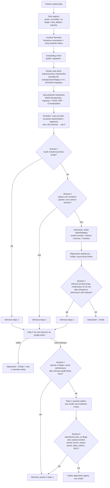

# Chatbot RAG: odpowiedzi wyłącznie z bazy dokumentów

[](https://github.com/OskarOG1/Chatbot-RAG/actions/workflows/ci.yml)

Chatbot, który na pytania o Allegro odpowiada **tylko na podstawie dostarczonych artykułów**, nigdy z ogólnej wiedzy modelu. Każda taka odpowiedź ma odnośniki do źródeł. Gdy odpowiedzi nie ma w bazie, system odmawia zamiast zmyślać. Pytanie spoza domeny Allegro może dostać krótką odpowiedź ogólną bez źródeł, obwarowaną własnym zestawem bramek (trzeci szczebel na diagramie niżej).

**Demo: [ogflow.pl](https://ogflow.pl)**

Baza testowa: 668 artykułów Allegro Pomoc, dwie sekcje (kupujący, sprzedający) w dwóch językach. Projekt edukacyjny, niezwiązany z Allegro.

Cały łańcuch napisany bez frameworka RAG. Zależności produkcyjne to `sentence-transformers`, `faiss-cpu`, `rank-bm25`, `simplemma`, `wordfreq`, `httpx`, `numpy`, `fastapi`, `uvicorn`. Retrieval, fuzja rankingów, bramki odmowy, orkiestracja i strumieniowanie są własne.

> Pełny zapis pracy, czyli każda decyzja z pomiarem i każda hipoteza odrzucona liczbami, jest w osobnym pliku: **[DECYZJE.md](DECYZJE.md)**. Ten README opisuje sam system i jego liczby.

---

## Liczby

| Co mierzone | Wynik |
|---|---|
| Baza wiedzy | 668 artykułów, 3563 fragmenty: PL 354 art./2121 frag., EN 314 art./1442 frag. |
| Trafność wyszukiwania, top 5 | kupujący PL **0.700** · sprzedaż PL **0.950** · kupujący EN **0.760** · sprzedaż EN **1.000** |
| Retrieval po aliasach (77 pytań PL ze znanym źródłem) | do generacji **76/77** · źródło wśród linków **62/77** · źródło na 1. miejscu **49/77** · trafienie sekcji **70/77** |
| Odpowiedź bez odmowy, pełny pipeline (GOLDEN, kupujący PL, 50 pytań) | **49/50** |
| Oczekiwane źródło w odpowiedzi, pełny pipeline (GOLDEN, kupujący PL, 50 pytań) | **40/50** |
| Odpowiedź bez odmowy, pełny pipeline (50 realnych pytań z forum Allegro, bez znanego źródła) | **40/50** |
| Fałszywe odmowy na bramce pokrycia | PL 0/29 · EN 1/50 |
| Pytania nie na temat złapane, pełny łańcuch | PL **25/26** (próg rerankera 17, sędzia 8) |
| Testy jednostkowe | **590/590** zielonych, CI na każdym pushu i PR |
| Model odpowiadający | `MODEL` i `MODEL_EN` w `.env`, domyślnie apertus 8B; prefiks dostawcy przełącza wywołanie na OpenRouter |

**Skąd te liczby.** Wiersz „trafność wyszukiwania" to pomiar z 2026-08-26 na ścieżce, która faktycznie obsługuje ruch: korekta literówek, embedding, BM25 i FAISS z RRF po obu sekcjach naraz, reranker, rozstrzygnięcie strony przez `strony.rozstrzygnij`. Zestawy: kupujący PL i EN po 50 pytań, sprzedaż PL 20, sprzedaż EN 19, wszystkie ze znanym źródłem (`Pomiary/dane_measure.json` oraz `RAG/golden_*.json`). Wcześniejsze wartości w tym wierszu (kupujący PL 0.840) pochodziły z innej konfiguracji: jedna sekcja zamiast dwóch i `k_surowe` 20 zamiast 6, więc nie są porównywalne i nie oznaczają regresji.

**Wiersz o aliasach to inny zestaw.** 77 pytań PL (GOLDEN 50, GOLDEN_SPRZEDAŻ 20, GOLDEN_BEZPIECZEŃSTWO 7), pomiar po dołożeniu słownictwa sytuacyjnego do tekstu retrievalowego. Wobec stanu przed aliasami: źródło na pierwszym miejscu 49 wobec 42, źródło wśród linków 62 wobec 59, trafienie sekcji 70 wobec 60. Jedenaście pytań zyskało poprawny link, zero straciło.

**Znane ograniczenie.** Trafność kupujący PL i EN (0.700 i 0.760) zostaje wyraźnie pod sprzedażową, bo artykuły o koncie, logowaniu i RODO nakładają się między sekcją kupujących i sprzedających. Na zestawie kupujący PL wszystkie sześć przerzutów na sekcję sprzedaży straciło oczekiwane źródło. Zablokowanie przerzutów podnosi ten wynik do 0.780, ale zabiera trafienia użytkownikowi, który stoi na drugiej zakładce, i tam spada ono do zera (`Pomiary/WYNIK_ZLA_ZAKLADKA.json`). Jawny przełącznik strony w interfejsie zamyka tę lukę dla użytkownika, który wie, po której jest stronie.

**O bramkach.** Wiersz „pytania nie na temat" mierzy cały łańcuch na 26 pytaniach spoza bazy (`OOD_SPOZA_TEMATU` 19 plus `OOD_ALLEGRO_POZA_BAZA` 7). Pozostałe 3 pytania z listy `OOD_DO_AUDYTU` pominięto celowo, bo to sensowne pytania sprzedawcy, na które baza ma odpowiedź, więc ich przepuszczenie nie jest błędem. Rozkład pracy między bramkami: próg rerankera zatrzymuje 17, sędzia kontekstu 8, przecieka 1. Fałszywe odmowy na golden: 4/50.

**Bramka odmowy stoi na sędzim.** Sam próg rerankera zatrzymuje 17 z 26 pytań spoza bazy, resztę łapie sędzia, czyli wywołanie modelu. Gdy sędzia jest niedostępny, zapytanie idzie dalej i trafia do logu jako `bramki_pominiete`, a przeciek rośnie z 1/26 do 9/26. Progiem tej luki nie da się zamknąć: pytania o Allegro, na które baza nie ma odpowiedzi, dostają od rerankera mediany wyższe niż pytania golden (+2.65 wobec +2.61), bo reranker mierzy podobieństwo tematu, nie obecność odpowiedzi.

**Trafność mierzy sam retrieval, nie odpowiedź.** Pozycje 4 i 5 nie zawierały oczekiwanego źródła ani razu na żadnym zestawie PL, czyli top 3 i top 5 dają ten sam wynik.

**Trzy wiersze o pełnym pipeline zmierzono na Bieliku-11B.** Wyniki 49/50, 40/50 i 40/50 pochodzą sprzed przełączenia modelu odpowiadającego i nie zostały powtórzone. Opisują ten sam łańcuch z innym modelem generującym, więc są punktem odniesienia, nie stanem bieżącym. GOLDEN ma znane źródło, więc liczy się i odmowa, i trafienie. 50 pytań realnych to ręcznie odsiane pytania o Allegro z `RAG/pytania_realne.jsonl` (5096 wpisów z forum), bez znanego źródła, więc liczy się tylko, czy system w ogóle odpowiedział: 8 odmów sędziego kontekstu, po jednej na bramce rerankera i na „model nie wie".

---

## Jak to działa



**Trzy niezależne bramki odmowy na pierwszym szczeblu.** Przed wyszukiwaniem odpadają pytania puste, krótsze niż 3 znaki, dłuższe niż 500 i próby manipulacji promptem (17 wzorców, dopasowywanych także po odwróceniu leetspeaku). Przed generacją: jeśli żaden fragment nie przekracza progu rerankera, model w ogóle nie jest wołany, a pytania graniczne ocenia osobne, tanie wywołanie modelu. Po generacji liczone jest pokrycie: udział ważonych IDF słów odpowiedzi, które faktycznie występują w kontekście.

**Trzeci szczebel odpowiada bez bazy, ale nigdy o Allegro.** Gdy obie sekcje odmówią, pytanie trafia do warstwy ogólnej (`src/ogolna.py`, wyłącznik `OGOLNA_ON`). Ta warstwa odrzuca wszystko, co wygląda na pytanie o Allegro, co dotyka tematu zablokowanego albo co odpadło blisko bazy, a wygenerowaną odpowiedź kasuje, jeśli pada w niej jakikolwiek konkret: kwota, termin, artykuł prawa, adres, telefon albo odnośnik.

**Sędzia pracuje równolegle z generacją.** Pierwsze 40 tokenów czeka w buforze na jego werdykt, więc bramka nie kosztuje czasu do pierwszego tokenu. Gdy bramka po generacji odrzuci odpowiedź, która już poszła do przeglądarki, klient dostaje zdarzenie `reset` i czyści to, co pokazał.

**Warstwa rozmowy przed RAG.** `src/rozmowa.py` klasyfikuje powitania, podziękowania, pytania o samego bota i tury sterujące („prościej", „rozwiń", potwierdzenia) zanim cokolwiek trafi do retrievalu, więc te tury nie zużywają wyszukiwania ani bramek.

**Dane mogą nie opuszczać serwera.** Wyszukiwanie, embeddingi i reranking działają lokalnie. Model generujący też może być lokalny.

---

## Retrieval

| Parametr | Wartość |
|---|---|
| Kandydaci po RRF | 12 na sekcję |
| Chunki podawane rerankerowi | `K_SUROWE_SEKCJI` = 6 na sekcję |
| Okno rerankera | 192 tokeny, w parze tytuł artykułu plus fragment |
| Kontekst do generacji | top 5 |
| Próg rerankera | PL −2.0 (globalna kalibracja przy K=6 daje −2.75), EN −3.6 |
| Próg pokrycia | PL 0.20, EN 0.35 |
| Minimalna przewaga sekcji | `PRZEWAGA_SEKCJI_MIN` = 0.5 |
| Okno historii rozmowy | 3 tury |

**Próg zależy od `K_SUROWE_SEKCJI`.** Kalibracja przy K=6 (`Pomiary/POMIAR_PROG_GLOBALNY_K6.md`) daje −2.75 jako najwyższy próg, przy którym rodzina pytań o przejęcie konta zostaje w komplecie: przy −2.50 schodzi na 6/7, a wobec −3.00 wszystkie kolumny są identyczne. Kolumny OOD w tej kalibracji: 12/19 pytań spoza tematu i 1/7 pytań o Allegro poza bazą odrzuconych już samym progiem.

**Rozstrzyganie sekcji.** Wyszukiwanie idzie po obu sekcjach naraz, a `strony.rozstrzygnij` wybiera stronę dopiero po rerankingu, wymagając przewagi 0.5 punktu. Poniżej tej przewagi użytkownik zostaje w swojej zakładce. Kalibracja na dwóch ramionach naraz, bo blokada przerzutów podnosi jedno ramię i zeruje drugie.

**Aliasy retrievalowe.** Chunki wybranych artykułów dostają dopisane słownictwo sytuacyjne (`src/aliasy.py`), doklejane wyłącznie do tekstu idącego do BM25, embeddingu i pary rerankera, nigdy do promptu ani do wyświetlanej treści. Artykuł o odzyskaniu dostępu do konta nie używa ani razu słów „włamał", „przejął", „nieautoryzowany", przez co pięć z siedmiu sformułowań ofiary w ogóle nie wchodziło do szóstki kandydatów. Po aliasie mediana top1 tej rodziny poszła z −1.709 na 0.591, a kolumny OOD w kalibracji progu nie drgnęły.

---

## Dobór technologii

| Element | Wybór | Dlaczego |
|---|---|---|
| Embeddingi | mmlw (PL), multilingual-e5-base (EN) | Trenowany pod polski, łapie znaczenie lepiej niż model wielojęzyczny |
| Baza wektorowa | FAISS | Lokalna, szybka, wystarcza na tej skali |
| Wyszukiwanie po słowach | BM25 + lematyzacja + trigramy | Sam embedding gubił pytania zbudowane wokół konkretnych słów |
| Reranker | mmarco-mMiniLMv2 (118M) | 26x szybszy od bge-v2-m3 przy stracie jednego trafienia, po zmianie okna na 192 i doklejeniu tytułu jeszcze 3.81x szybszy i trafniejszy |
| Model odpowiadający | konfigurowalny przez `MODEL` | Na 11 realnych pytaniach PL apertus 8B był szybszy od Bielika-11B w 11 parach na 11, mediana 3.45 s wobec 6.54 s, najgorszy przypadek 6.3 s wobec 22.7 s |
| Sędzia kontekstu | Bielik-11B (PL), Olmo-3-7B (EN) | Odpięty od modelu odpowiadającego, decyzja TAK/NIE jest lżejsza niż generacja |

**Sędzia i mail mają własne zmienne.** `SEDZIA_MODEL` oraz `EMAIL_MODEL` są niezależne od `MODEL`. Sędzia celowo, bo decyzja TAK/NIE jest innym zadaniem niż generacja. Szkic maila (`agents_mail.py`) czyta `EMAIL_MODEL` na sztywno: to nie jest decyzja poparta pomiarem, tylko stan zastany.

**Router dostawców.** Model z prefiksem `openai/`, `anthropic/`, `google/`, `x-ai/` lub `deepseek/` idzie przez OpenRouter, reszta przez `LLM_BASE_URL`. `src/koszty.py` trzyma cennik wejścia i wyjścia na milion tokenów i sumuje koszt na turę, także dla wywołań sędziego i szkicu maila.

Uzasadnienia z liczbami, razem z wariantami odrzuconymi, są w [DECYZJE.md](DECYZJE.md).

---

## Pomiary wydajności

| Zmiana | Przed | Po |
|---|---|---|
| Reranker: tytuł w parze, okno 192, k=12 | punkt odniesienia | **3.81x** szybciej, wyższa trafność |
| Reranker: mmarco-mMiniLMv2 zamiast bge-v2-m3 | punkt odniesienia | **26x** szybciej, jedno trafienie mniej |
| Przeliczenie embeddingów po dociągnięciu artykułu | 220 minut na 2121 chunkach | **162 sekundy** (2095 wierszy przepisanych, 26 policzonych, kosinus 1.000 z pełnym przeliczeniem) |
| Przycinanie kontekstu sędziego | 72.7 ms zysku | odrzucone: łamie bramkę przy każdym limicie, domyślnie wyłączone |

**Składanie macierzy zamiast pełnego przeliczania.** Chunk, którego tekst retrievalowy jest identyczny jak w starym korpusie, dostaje swój stary wiersz. Liczone są tylko teksty nowe oraz wszystkie chunki z aliasem, bo o tych drugich nie da się orzec, czy stary wektor powstał już z aliasem. Bezpiecznik: powyżej 40 nowych tekstów skrypt przerywa, bo zmieniło się wtedy więcej niż jeden dociągnięty artykuł.

**Trzy artefakty trzeba odświeżać razem.** `chunks_*.json`, `*.bm25` i `*.faiss` mają osobne cache w pamięci procesu, unieważniane po znaczniku czasu własnego pliku. Podmiana samych chunków bez przebudowy indeksu nie wywoła błędu, tylko cicho rozjedzie numerację: FAISS zwróci pozycje ze starego indeksu, a odczytane zostaną nowe fragmenty. Osobny test (`tests/test_wektory_pozycyjnie.py`) pilnuje zgodności pozycyjnej wektorów z chunkami.

---

## Bezpieczeństwo i odporność

**Manipulacja promptem.** Filtry wejścia odrzucają znane wzorce, także po odwróceniu leetspeaku, ale realną obroną jest oparcie odpowiedzi na kontekście i bramka pokrycia. Filtr wzorców to jedna warstwa, nie całość.

**Logi bez danych osobowych.** `trudne.jsonl` dostaje wyłącznie nierozpoznane pojedyncze słowa, nigdy całe pytanie. Log analityczny zapisuje treść pytania dopiero po redakcji: maile, telefony, numery zamówień i adresy URL idą do `[ukryte]`.

**Limity.** Globalny (domyślnie 15/min, 200/dzień) chroni budżet API, per IP (10/min, 40/dzień) chroni przed pojedynczym nadużywającym klientem. Osobne, luźniejsze progi mają oceny i panel. Wysyłka maila ma własny, najostrzejszy limit, bo to jedyne prawdziwe wywołanie zewnętrzne.

**Awarie nie blokują odpowiedzi, ale zostawiają ślad.** Gdy sędzia albo dane IDF są niedostępne, bramka jest pomijana, a zapytanie odnotowane w logu jako `bramki_pominiete`. Gdy w oknie 50 zapytań ponad 20 procent ma pominiętą bramkę, serwer krzyczy na stderr. Model główny ma automatyczny fallback na zapasowy.

**Panel bez tokenu jest zamknięty, ale zbieranie działa.** Bez `ADMIN_TOKEN` kolejka zgłoszeń i reset statystyk odpowiadają kodem 503, a same zgłoszenia od użytkowników zapisują się dalej. Reset jest jedyną operacją nieodwracalną, wymaga nagłówka `x-admin-token` i archiwizuje log zamiast go kasować.

---

## API i frontend

Backend: **FastAPI**. `POST /chat` zwraca JSON (odpowiedź, źródła, cytaty), `POST /chat/stream` ten sam proces przez SSE. Poza tym `POST /send-email`, `POST /ocena`, `POST /zgloszenie` oraz `GET /health`. Pod panel: `GET /admin/statystyki`, `/admin/oceny`, `/admin/kolejka`, `/admin/kolejka/eksport`, `/admin/eksport` i `POST /admin/kolejka/odpowiedz`, `/admin/resetuj-statystyki`.

Strumień SSE ma pięć typów zdarzeń: `krok` (co system właśnie robi), `token` (fragment odpowiedzi), `reset` (bramka odrzuciła to, co już poszło do przeglądarki), `wynik` (koniec tury z cytatami) i `blad`. Obsługa `reset` jest w kliencie obowiązkowa.

Każda tura zapisuje do logu analitycznego cechy decyzji: `rerank_top1`, liczbę chunków, `zrodlo_top1`, werdykt sędziego, wartość pokrycia, numer etapu drabiny, wybraną stronę, powód odmowy z listy `prog_rerank`, `sedzia`, `pokrycie`, `model_nie_wie`, `jawna_odmowa`, `brak_generacji`, oraz latencję i koszt tokenów. Panel liczy z tego rozkłady, kwantyle latencji i szeregi dzienne.

Frontend: **Next.js 16 / React 19** (`frontend-next/`, ok. 4.9 tys. linii TSX). Czat ze streamingiem, klikalne cytaty, panel edycji maila z porzuceniem szkicu, 15-sekundowym oknem na cofnięcie wysyłki i korektą po wysłaniu, oraz panel analityczny pod `/admin` z wykresami Recharts. Przeglądarka nie rozmawia z FastAPI bezpośrednio, wszystko idzie przez Route Handlery, więc jeden origin i zero CORS.

**Cytaty.** Prompt każe wstawiać odnośniki `[n]` i zabrania gołych adresów URL. Kod wycina linki z tekstu i mapuje `[n]` na źródło. Cytaty służą wyłącznie do wyświetlania, do odmowy używane jest pokrycie, nie obecność `[n]`.

**Podpowiedzi kontekstowe.** Po odpowiedzi generowane są trzy propozycje kolejnych pytań, budowane ze śródtytułów artykułu z pierwszego miejsca, bez wywołania modelu.

**Pamięć rozmowy.** Okno 3 tur. Dopytania wykryte tanim detektorem są przepisywane przez model na samodzielne pytanie przed wyszukiwaniem, więc „a co jeśli sprzedawca nie odpowiada?" po pytaniu o reklamację trafia poprawnie.

---

## Wersja dwujęzyczna i wysyłka maila

Druga, równoległa ścieżka dla klienta anglojęzycznego: własny embedder (`multilingual-e5-base`), własny indeks, własny sędzia i własne progi odmowy (`prog_rerank` −3.6, `prog_pokrycia` 0.35 wobec −2.0 i 0.20 dla polskiego). Językiem steruje detekcja po częstości słów, nie przełącznik, więc pytanie po polsku zawsze dostaje odpowiedź po polsku.

Panel edycji maila ma prawdziwy przycisk wysyłki. Treść idzie do stałej demo-skrzynki sprzedawcy, a potwierdzenie z numerem zgłoszenia na adres klienta, przez REST Resend, bez SMTP. Bez skonfigurowanego `RESEND_API_KEY` wysyłka zwraca czytelny błąd konfiguracji, nigdy fałszywy sukces. Log serwera zapisuje tylko numer zgłoszenia, kategorię, powód odmowy dostawcy i wynik, nigdy adresu ani treści.

---

## Pętla uczenia z produkcji

Odmowa z powodem z listy `prog_rerank`, `sedzia`, `pokrycie`, `model_nie_wie`, `jawna_odmowa` albo `brak_generacji` może trafić do kolejki zgłoszeń (`RAG/kolejka.jsonl`, identyfikator ośmioznakowy, retencja adresu 30 dni). Panel pozwala oznaczyć zgłoszenie etykietą `luka_w_bazie`, `prog_za_wysoki`, `poza_zakresem` albo `spam`. Dla luki w bazie `src/petla.py` składa listę do przeglądu z propozycją źródła i wynikiem rerankera, `src/dociagnij.py` pobiera brakujący artykuł do korpusu, a `src/zastosuj_przeglad.py` stosuje decyzje człowieka.

Brama adresów w `dociagnij.py`: 184 z 184 prawdziwych adresów pomocy kupującego przechodzą, 7 z 7 adresów o złej głębokości ścieżki, złym hoście lub schemacie `http` jest odrzucanych przed pobraniem.

Pierwsze domknięcie pętli na żywym zgłoszeniu: dociągnięcie brakującego artykułu plus alias podniosło wynik rerankera dla pytania z −3.568 na +2.548.

---

## Struktura repozytorium

```
src/            backend: pipeline, bramki, retrieval, agenci, API, pętla uczenia
frontend-next/  frontend Next.js, czat i panel analityczny
tests/          590 testow jednostkowych, bez wywołań modelu
docker/         compose, Dockerfile API, Caddy, skrypty kopii zapasowych
RAG/            korpus, indeksy i logi (poza gitem)
Pomiary/        skrypty pomiarowe i raporty (poza gitem)
```

Repozytorium nie zawiera korpusu: katalogi `RAG/docs*`, zbudowane indeksy i logi są poza gitem. Skrypty ETL (scraping, chunking, scalanie korpusu, embedder, budowa indeksów) są w `src/`.

Szczegóły: [DECYZJE.md](DECYZJE.md).
