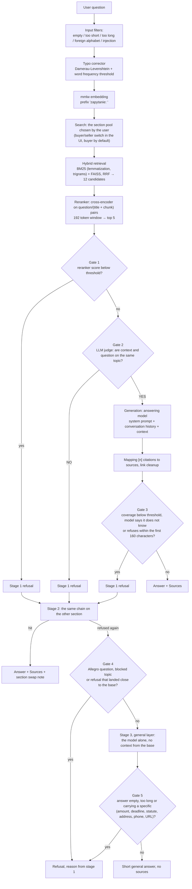

# RAG Chatbot: answers drawn exclusively from a document base

[](https://github.com/OskarOG1/Chatbot-RAG/actions/workflows/ci.yml)

A chatbot that answers questions about Allegro **only on the basis of the supplied articles**, never from the model's general knowledge. Every such answer links to its sources. When the answer is not in the base, the system refuses instead of making things up. A question outside the Allegro domain may get a short general answer with no sources, fenced in by its own set of gates (the third rung on the diagram below).

**Demo: [ogflow.pl](https://ogflow.pl)**

Test corpus: 668 Allegro Help articles, two sections (buyer, seller) in two languages. An educational project, not affiliated with Allegro.

The whole chain is written without a RAG framework. The production dependencies are `sentence-transformers`, `faiss-cpu`, `rank-bm25`, `simplemma`, `wordfreq`, `httpx`, `numpy`, `fastapi`, `uvicorn`. Retrieval, rank fusion, refusal gates, orchestration and streaming are all hand written.

> The full record of the work, every decision with its measurement and every hypothesis rejected by numbers, lives in a separate file: **[DECISIONS.md](DECISIONS.md)**. This README describes the system itself and its numbers.

---

## Numbers

| Metric | Result |
|---|---|
| Knowledge base | 668 articles, 3563 chunks: PL 354 art./2121 chunks, EN 314 art./1442 chunks |
| Retrieval accuracy, top 5 | buyer PL **0.700** · seller PL **0.950** · buyer EN **0.760** · seller EN **1.000** |
| Retrieval after aliases (77 PL questions with a known source) | reaches generation **76/77** · source among the links **62/77** · source ranked first **49/77** · correct section **70/77** |
| Answered without refusing, full pipeline (GOLDEN, buyer PL, 50 questions) | **49/50** |
| Expected source present in the answer, full pipeline (GOLDEN, buyer PL, 50 questions) | **40/50** |
| Answered without refusing, full pipeline (50 real forum questions, no known source) | **40/50** |
| False refusals on the coverage gate | PL 0/29 · EN 1/50 |
| Off-topic questions caught, full chain | PL **25/26** (reranker threshold 17, judge 8) |
| Unit tests | **590/590** green, CI on every push and PR |
| Answering model | `MODEL` and `MODEL_EN` in `.env`, apertus 8B by default; a provider prefix routes the call through OpenRouter |

**Where these numbers come from.** The "retrieval accuracy" row is a 2026-08-26 measurement on the path that actually serves traffic: typo correction, embedding, BM25 and FAISS fused by RRF across both sections at once, reranker, side resolution through `strony.rozstrzygnij`. Sets: buyer PL and EN 50 questions each, seller PL 20, seller EN 19, all with a known source (`Pomiary/dane_measure.json` and `RAG/golden_*.json`). The earlier values in this row (buyer PL 0.840) came from a different configuration: one section instead of two and `k_surowe` 20 instead of 6, so they are not comparable and do not mean a regression.

**The alias row is a different set.** 77 PL questions (GOLDEN 50, GOLDEN_SELLER 20, GOLDEN_SECURITY 7), measured after situational vocabulary was appended to the retrieval text. Against the state before aliases: source ranked first 49 against 42, source among the links 62 against 59, correct section 70 against 60. Eleven questions gained the right link, zero lost it.

**Known limitation.** Buyer PL and EN accuracy (0.700 and 0.760) stays clearly under the seller figures, because articles on accounts, logging in and GDPR overlap between the buyer and seller sections. On the buyer PL set all six switches to the seller section lost the expected source. Blocking those switches lifts the figure to 0.780, but it takes hits away from a user standing on the other tab, where it then drops to zero (`Pomiary/WYNIK_ZLA_ZAKLADKA.json`). The explicit side switch in the interface closes that gap for a user who knows which side they are on.

**About the gates.** The "off-topic questions" row measures the whole chain on 26 questions outside the base (`OOD_SPOZA_TEMATU` 19 plus `OOD_ALLEGRO_POZA_BAZA` 7). The remaining 3 questions from `OOD_DO_AUDYTU` were skipped on purpose, because they are reasonable seller questions the base can answer, so letting them through is not an error. How the work splits: the reranker threshold stops 17, the context judge 8, one leaks. False refusals on golden: 4/50.

**The refusal gate rests on the judge.** The reranker threshold alone stops 17 of the 26 out of base questions, the judge catches the rest, and the judge is a model call. When it is unavailable the request goes through and lands in the log as `bramki_pominiete`, and the leak grows from 1/26 to 9/26. No threshold closes that gap: Allegro questions the base cannot answer get higher reranker medians than golden questions (+2.65 against +2.61), because the reranker measures topical similarity, not the presence of an answer.

**Accuracy measures retrieval alone, not the answer.** Positions 4 and 5 never once held the expected source on any PL set, so top 3 and top 5 give the same figure.

**The three full pipeline rows were measured on Bielik-11B.** The 49/50, 40/50 and 40/50 figures predate the switch of the answering model and were not repeated. They describe the same chain with a different generating model, so treat them as a reference point, not the current state. GOLDEN has a known source, so both refusal and hit are counted. The 50 real questions are hand sifted Allegro questions from `RAG/pytania_realne.jsonl` (5096 forum entries) with no known source, so only whether the system answered at all is counted: 8 context judge refusals, one each on the reranker gate and on "the model does not know".

---

## How it works



**Three independent refusal gates on the first rung.** Before retrieval the system drops empty questions, anything shorter than 3 characters or longer than 500, and prompt manipulation attempts (17 patterns, matched also after leetspeak is folded back). Before generation: if no chunk clears the reranker threshold the model is never called at all, and borderline questions are judged by a separate, cheap model call. After generation the system computes coverage: the share of IDF weighted answer words that actually occur in the context.

**The third rung answers without the base, but never about Allegro.** When both sections refuse, the question goes to the general layer (`src/ogolna.py`, `OGOLNA_ON` kill switch). That layer rejects anything that looks like an Allegro question, touches a blocked topic, or was refused close to the base, and it discards the generated answer if it carries any specific: an amount, a deadline, a statute, an address, a phone number or a link.

**The judge runs in parallel with generation.** The first 40 tokens wait in a buffer for its verdict, so the gate costs nothing in time to first token. When a post-generation gate rejects an answer that already reached the browser, the client receives a `reset` event and clears what it has shown.

**A conversation layer sits in front of RAG.** `src/rozmowa.py` classifies greetings, thanks, questions about the bot itself and control turns ("simpler", "expand", confirmations) before anything reaches retrieval, so those turns spend neither a search nor a gate.

**Your data can stay on the server.** Retrieval, embeddings and reranking all run locally. The generating model can be local too.

---

## Retrieval

| Parameter | Value |
|---|---|
| Candidates after RRF | 12 per section |
| Chunks handed to the reranker | `K_SUROWE_SEKCJI` = 6 per section |
| Reranker window | 192 tokens, the pair holds the article title plus the chunk |
| Context passed to generation | top 5 |
| Reranker threshold | PL −2.0 (the global calibration at K=6 gives −2.75), EN −3.6 |
| Coverage threshold | PL 0.20, EN 0.35 |
| Minimum section margin | `PRZEWAGA_SEKCJI_MIN` = 0.5 |
| Conversation history window | 3 turns |

**The threshold depends on `K_SUROWE_SEKCJI`.** The calibration at K=6 (`Pomiary/POMIAR_PROG_GLOBALNY_K6.md`) gives −2.75 as the highest threshold at which the account takeover question family survives intact: at −2.50 it drops to 6/7, and against −3.00 every column is identical. The OOD columns in that calibration: 12/19 off-topic questions and 1/7 Allegro questions outside the base rejected by the threshold alone.

**Section resolution.** The search runs across both sections at once, and `strony.rozstrzygnij` picks a side only after reranking, requiring a 0.5 point margin. Below that margin the user stays on their own tab. It is calibrated on both arms at once, because blocking the switches lifts one arm and zeroes the other.

**Retrieval aliases.** Chunks of selected articles get situational vocabulary appended (`src/aliasy.py`), added only to the text that feeds BM25, the embedding and the reranker pair, never to the prompt or to the displayed content. The article on recovering account access never uses the words "broke in", "took over" or "unauthorized", which kept five of seven victim phrasings out of the candidate six entirely. After the alias the family's median top1 moved from −1.709 to 0.591, and the OOD columns of the threshold calibration did not move at all.

---

## Technology choices

| Component | Choice | Why |
|---|---|---|
| Embeddings | mmlw (PL), multilingual-e5-base (EN) | Trained for Polish, captures meaning better than a multilingual model |
| Vector store | FAISS | Local, fast, plenty at this scale |
| Lexical retrieval | BM25 + lemmatization + trigrams | Embeddings alone missed questions built around specific words |
| Reranker | mmarco-mMiniLMv2 (118M) | 26x faster than bge-v2-m3 at the cost of one hit, then another 3.81x faster and more accurate after the 192 token window and the title in the pair |
| Answering model | configurable through `MODEL` | On 11 real PL questions apertus 8B beat Bielik-11B in 11 pairs out of 11, median 3.45 s against 6.54 s, worst case 6.3 s against 22.7 s |
| Context judge | Bielik-11B (PL), Olmo-3-7B (EN) | Decoupled from the answering model, a YES/NO decision is lighter than generation |

**The judge and the mail have their own variables.** `SEDZIA_MODEL` and `EMAIL_MODEL` are independent of `MODEL`. The judge deliberately so, because a YES/NO decision is a different task than generation. The mail draft (`agents_mail.py`) reads `EMAIL_MODEL` directly: that is not a measured decision, just the state as it stands.

**Provider router.** A model prefixed `openai/`, `anthropic/`, `google/`, `x-ai/` or `deepseek/` goes through OpenRouter, everything else through `LLM_BASE_URL`. `src/koszty.py` holds input and output rates per million tokens and sums the cost per turn, including the judge and mail draft calls.

The reasoning with numbers, including the rejected variants, is in [DECISIONS.md](DECISIONS.md).

---

## Performance measurements

| Change | Before | After |
|---|---|---|
| Reranker: title in the pair, 192 window, k=12 | reference point | **3.81x** faster, higher accuracy |
| Reranker: mmarco-mMiniLMv2 instead of bge-v2-m3 | reference point | **26x** faster, one hit fewer |
| Embedding rebuild after pulling one article | 220 minutes over 2121 chunks | **162 seconds** (2095 rows copied, 26 computed, cosine 1.000 against a full rebuild) |
| Trimming the judge's context | 72.7 ms saved | rejected: it breaks the gate at every limit, off by default |

**Assembling the matrix instead of recomputing it.** A chunk whose retrieval text is identical to the old corpus keeps its old row. Only new texts and every aliased chunk are computed, because for the latter there is no way to tell whether the old vector already carried the alias. Safety catch: above 40 new texts the script aborts, because more than a single pulled article has changed by then.

**Three artifacts must be refreshed together.** `chunks_*.json`, `*.bm25` and `*.faiss` each have their own in-process cache, invalidated by their own file timestamp. Swapping the chunks without rebuilding the index raises no error, it silently desynchronizes the numbering: FAISS returns positions from the old index while the new chunks are read. A dedicated test (`tests/test_wektory_pozycyjnie.py`) guards the positional match between vectors and chunks.

---

## Security and robustness

**Prompt manipulation.** Input filters reject known patterns, including after leetspeak is folded back, but the real defence is grounding the answer in the context plus the coverage gate. A pattern filter is one layer, not the whole story.

**Logs without personal data.** `trudne.jsonl` receives only unrecognized single words, never a whole question. The analytics log stores the question text only after redaction: emails, phone numbers, order numbers and URLs become `[ukryte]`.

**Rate limits.** The global one (15/min, 200/day by default) protects the API budget, the per IP one (10/min, 40/day) protects against a single abusive client. Ratings and the panel have their own, looser thresholds. Sending mail has the tightest limit of all, because it is the only real external call.

**Failures never block an answer, but they always leave a trace.** When the judge or the IDF data are unavailable, the gate is skipped and the request is logged with `bramki_pominiete`. When more than 20 percent of the last 50 requests skipped a gate, the server shouts on stderr. The main model has an automatic fallback to a backup one.

**Without a token the panel is closed, but collection keeps running.** Without `ADMIN_TOKEN` the ticket queue and the statistics reset answer with 503, while user tickets keep being written. The reset is the only irreversible operation, requires an `x-admin-token` header, and archives the log instead of deleting it.

---

## API and frontend

Backend: **FastAPI**. `POST /chat` returns JSON (answer, sources, citations), `POST /chat/stream` runs the same pipeline over SSE. Beyond that: `POST /send-email`, `POST /ocena`, `POST /zgloszenie` and `GET /health`. Behind the panel: `GET /admin/statystyki`, `/admin/oceny`, `/admin/kolejka`, `/admin/kolejka/eksport`, `/admin/eksport` plus `POST /admin/kolejka/odpowiedz` and `/admin/resetuj-statystyki`.

The SSE stream carries five event types: `krok` (what the system is doing right now), `token` (a fragment of the answer), `reset` (a gate rejected what already reached the browser), `wynik` (end of turn with citations) and `blad`. Handling `reset` is mandatory in any client.

Every turn writes the decision features to the analytics log: `rerank_top1`, the chunk count, `zrodlo_top1`, the judge's verdict, the coverage value, the ladder stage, the chosen side, the refusal reason out of `prog_rerank`, `sedzia`, `pokrycie`, `model_nie_wie`, `jawna_odmowa`, `brak_generacji`, plus latency and token cost. The panel turns that into distributions, latency quantiles and daily series.

Frontend: **Next.js 16 / React 19** (`frontend-next/`, about 4.9k lines of TSX). Chat with live streaming, clickable citations, a mail editing panel with draft discarding, a 15 second undo window and correction after sending, plus the analytics panel under `/admin` with Recharts plots. The browser never talks to FastAPI directly, everything goes through Route Handlers, so one origin and no CORS.

**Citations.** The prompt requires `[n]` markers and forbids bare URLs. The code strips links from the text and maps `[n]` to a source. Citations exist purely for display, refusal is driven by coverage, not by the presence of `[n]`.

**Contextual suggestions.** After each answer three follow-up questions are offered, built from the subheadings of the top ranked article, with no model call.

**Conversation memory.** A 3 turn window. Follow-ups detected by a cheap detector are rewritten by the model into standalone questions before retrieval, so "what if the seller does not reply?" after a question about complaints lands correctly.

---

## Bilingual path and sending mail

A second, parallel path for English speaking customers: its own embedder (`multilingual-e5-base`), its own index, its own judge and its own refusal thresholds (`prog_rerank` −3.6, `prog_pokrycia` 0.35 against −2.0 and 0.20 for Polish). The language is picked by word frequency detection rather than a switch, so a Polish question always gets a Polish answer.

The mail editing panel has a real send button. The message goes to a fixed demo seller inbox, and a confirmation with a ticket number goes to the customer address, over the Resend REST API, no SMTP. Without a configured `RESEND_API_KEY` sending returns a clear configuration error, never a false success. The server log stores only the ticket number, the category, the provider's refusal reason and the outcome, never the address or the body.

---

## Learning loop from production

A refusal whose reason is `prog_rerank`, `sedzia`, `pokrycie`, `model_nie_wie`, `jawna_odmowa` or `brak_generacji` can be escalated to the ticket queue (`RAG/kolejka.jsonl`, eight character id, 30 day retention on the address). The panel labels a ticket `luka_w_bazie`, `prog_za_wysoki`, `poza_zakresem` or `spam`. For a knowledge gap, `src/petla.py` assembles the review list with a proposed source and its reranker score, `src/dociagnij.py` pulls the missing article into the corpus, and `src/zastosuj_przeglad.py` applies the human decisions.

The URL gate in `dociagnij.py`: 184 of 184 real buyer help URLs pass, 7 of 7 URLs with the wrong path depth, the wrong host or an `http` scheme are rejected before any fetch.

The first closed loop on a live ticket: pulling the missing article plus an alias lifted the reranker score for that question from −3.568 to +2.548.

---

## Repository layout

```
src/            backend: pipeline, gates, retrieval, agents, API, learning loop
frontend-next/  Next.js frontend, chat and analytics panel
tests/          590 unit tests, no model calls
docker/         compose, API Dockerfile, Caddy, backup scripts
RAG/            corpus, indexes and logs (outside git)
Pomiary/        measurement scripts and reports (outside git)
```

The repository does not ship the corpus: the `RAG/docs*` directories, the built indexes and the logs live outside git. The ETL scripts (scraping, chunking, corpus merge, embedder, index build) are in `src/`.

Details: [DECISIONS.md](DECISIONS.md).
