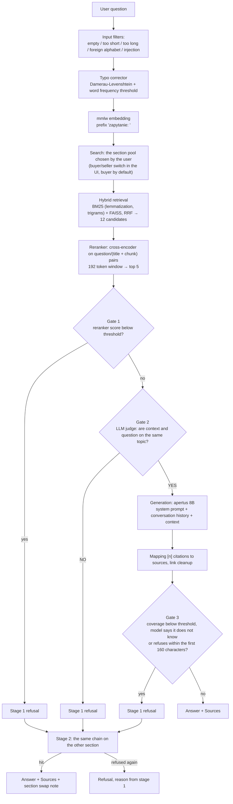

# RAG Chatbot: answers drawn exclusively from a document base

[](https://github.com/OskarOG1/Chatbot-RAG/actions/workflows/ci.yml)

A chatbot that answers questions **only on the basis of the supplied articles**, never from the model's general knowledge. Every answer links to its sources. When the answer is not in the base, the system refuses instead of making things up.

**Demo: [ogflow.pl](https://ogflow.pl)**

Test corpus: 667 Allegro Help articles, two sections (buyer, seller) in two languages. An educational project, not affiliated with Allegro.

> The full record of the work, every decision with its measurement and every hypothesis rejected by numbers, lives in a separate file: **[DECISIONS.md](DECISIONS.md)**. This README describes the system itself.

---

## Results

| Metric | Result |
|---|---|
| Knowledge base | 667 articles, 3551 chunks: PL 353 art./2109 chunks, EN 314 art./1442 chunks |
| Retrieval accuracy, top 5 | buyer PL **0.840** · seller PL **1.000** · buyer EN **0.800** · seller EN **0.947** |
| False refusals on the coverage gate | PL 0/29 · EN 1/50 |
| Off-topic questions caught | PL 29/29 · EN 29/29 |
| Unit tests | **305/305** green, CI on every push and PR |
| Answering model | apertus 8B, PL and EN (exact id set by `MODEL` in `.env`) |

**Known limitation.** Buyer EN accuracy (0.800) stays about 12 percentage points under the 0.920 ceiling, because articles on accounts, logging in and GDPR overlap between the buyer and seller sections. The explicit side switch in the interface closes that gap for a user who knows which side they are on.

---

## How it works



**Three independent refusal gates.** Before retrieval, empty, too short and too long questions are dropped along with prompt manipulation attempts. Before generation: if no chunk matches well enough the model is never called at all, and borderline questions are judged by a separate, cheap model call. After generation the system checks how many meaningful words of the answer actually occur in the sources.

**The judge runs in parallel with generation.** The first 40 tokens wait in a buffer for its verdict, so the gate costs nothing in time to first token. When a post-generation gate rejects an answer that already reached the browser, the client receives a `reset` event and clears what it has shown.

**Your data can stay on the server.** Retrieval, embeddings and reranking all run locally. The generating model can be local too, mine is not, for hardware reasons.

---

## Quick start

You need Docker and an OpenAI-compatible model endpoint (a local Ollama or a cloud provider).

```bash
cp docker/.env.example docker/.env
```

Fill in at least `LLM_BASE_URL`, `LLM_API_KEY`, `MODEL` and `DOMAIN` in `docker/.env`, then:

```bash
docker compose -f docker/docker-compose.yml up -d --build
```

The frontend comes up on ports 80 and 443 behind Caddy, the API stays on the internal network only. The first start takes longer, because the container warms up the reranker, two embedders and the indexes.

**The repository does not ship the corpus.** The `RAG/docs*` directories and the built indexes live outside git. To build the base from scratch, from the `src/` directory:

```bash
python links_scraping.py && python links_scraping_sprzedaz.py --lang pl
```

```bash
python chunking.py --lang pl --docs-dir ../RAG/docs --out ../RAG/chunks_kupujacy.json
```

```bash
python chunking.py --lang pl --docs-dir ../RAG/docs_sprzedaz --out ../RAG/chunks_sprzedaz.json
```

```bash
python scal_korpus.py --lang pl && python embedder.py --lang pl && python vector.py --lang pl
```

Swapping the corpus on a running instance needs `docker compose restart api`: the BM25 and FAISS indexes load into process memory once and have no invalidation, even though the answer cache refreshes itself when the files change.

Tests:

```bash
pytest tests -q
```

---

## Technology choices

| Component | Choice | Why |
|---|---|---|
| Embeddings | mmlw | Trained for Polish, captures meaning better than a multilingual model |
| Vector store | FAISS | Local, fast, plenty at this scale |
| Lexical retrieval | BM25 + lemmatization + trigrams | Embeddings alone missed questions built around specific words |
| Reranker | mmarco-mMiniLMv2 (118M) | 26x faster than bge-v2-m3 at the cost of one hit, then another 3.81x faster and more accurate after the 192 token window and the title in the pair |
| Answering model | apertus 8B | On 25 PL and 25 EN questions it matches or beats Bielik-11B on quality, with no API errors and about 3x faster |
| Context judge | Bielik-11B (PL), Olmo-3-7B (EN) | Decoupled from the answering model, a YES/NO decision is lighter than generation |

The reasoning with numbers, including the rejected variants, is in [DECISIONS.md](DECISIONS.md).

---

## Security and robustness

**Prompt manipulation.** Input filters reject known patterns, including after leetspeak is folded back, but the real defence is grounding the answer in the context plus the coverage gate. A pattern filter is one layer, not the whole story.

**Logs without personal data.** `trudne.jsonl` receives only unrecognized single words, never a whole question. The analytics log stores the question text only after redaction: emails, phone numbers, order numbers and URLs become `[ukryte]`.

**Rate limits.** The global one (15/min, 200/day by default) protects the API budget, the per IP one (10/min, 40/day) protects against a single abusive client. Ratings and the panel have their own, looser thresholds. Sending a message has the tightest limit of all, because it is the only real external call.

**Failures never block an answer, but they always leave a trace.** When the judge or the IDF data are unavailable, the gate is skipped and the request is logged with `bramki_pominiete`. When more than 20 percent of the last 50 requests skipped a gate, the server shouts on stderr. The main model has an automatic fallback to a backup one.

---

## API and frontend

Backend: **FastAPI**. `POST /chat` returns JSON (answer, sources, citations), `POST /chat/stream` runs the same pipeline over SSE. Beyond that: `POST /send-email`, `POST /ocena` and `GET /admin/statystyki`, `/admin/oceny`, `/admin/eksport` plus `POST /admin/resetuj-statystyki` behind the analytics panel. The reset is the only irreversible operation, requires an `x-admin-token` header, and archives the log instead of deleting it.

The SSE stream carries five event types: `krok` (what the system is doing right now), `token` (a fragment of the answer), `reset` (a gate rejected what already reached the browser), `wynik` (end of turn with citations) and `blad`. Handling `reset` is mandatory in any client.

Frontend: **Next.js** (`frontend-next/`). Chat with live streaming, clickable citations, a mail editing panel with draft discarding, a 15 second undo window and correction after sending, plus the analytics panel under `/admin`. The browser never talks to FastAPI directly, everything goes through Route Handlers, so one origin and no CORS.

**Citations.** The prompt requires `[n]` markers and forbids bare URLs. The code strips links from the text and maps `[n]` to a source. Citations exist purely for display, refusal is driven by coverage, not by the presence of `[n]`.

**Conversation memory.** A 3 turn window. Follow-ups detected by a cheap detector are rewritten by the model into standalone questions before retrieval, so "what if the seller does not reply?" after a question about complaints lands correctly.

---

## Bilingual version and sending mail

A second, parallel path for English speaking customers: its own embedder (`multilingual-e5-base`), its own index, its own judge and its own refusal thresholds (`prog_rerank` −3.6, `prog_pokrycia` 0.35 against −5.7 and 0.20 for Polish). The language is picked by word frequency detection rather than a switch, so a Polish question always gets a Polish answer.

The mail editing panel has a real send button. The message goes to a fixed demo seller inbox, and a confirmation with a ticket number goes to the customer address, over the Resend REST API, no SMTP. Without a configured `RESEND_API_KEY` sending returns a clear configuration error, never a false success. The server log stores only the ticket number, the category and the outcome, never the address or the body.

---

## Repository layout

```
src/            backend: pipeline, gates, retrieval, agents, API
frontend-next/  Next.js frontend, chat and analytics panel
tests/          305 unit tests, no model calls
docker/         compose, API Dockerfile, Caddy, backup scripts
RAG/            corpus, indexes and logs (outside git)
```

Details: [DECISIONS.md](DECISIONS.md).
